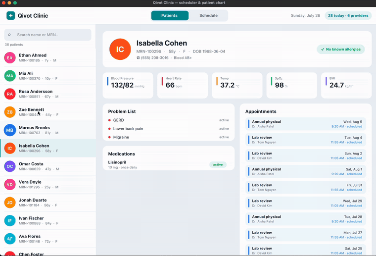
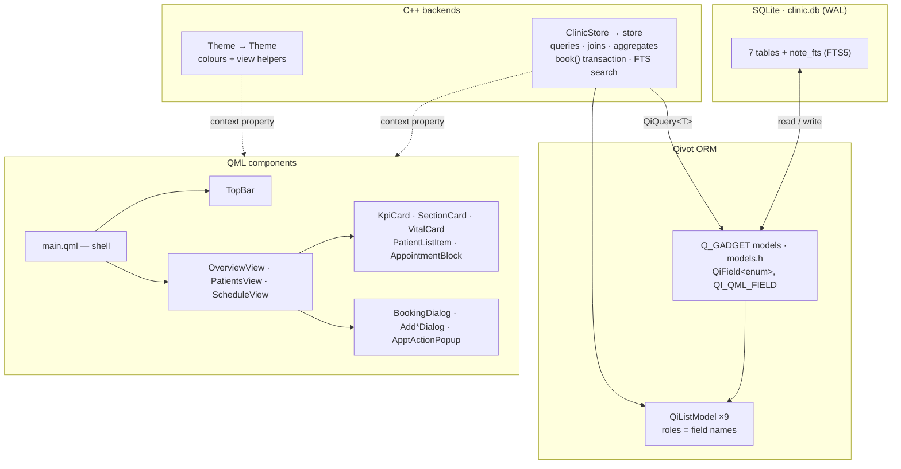

# Tutorial — Qivot Clinic: a basic EHR (scheduler + patient chart)

A small but real **electronic health record** across three views: a
**practice-overview dashboard** with live analytics, a searchable patient
directory with a full clinical **chart**, and a **day-calendar scheduler** you can
book into — with a booking rule that refuses to double-book a provider. You can
also **add patients, notes, and vitals**, and **full-text search every clinical
note**. It's the example that pulls most of Qivot together in one app. **All data
is synthetic** (generated at startup); there are no real patients.

**▶ [Try it live in your browser](https://austinkottke.github.io/Qivot/)** — this same app,
compiled to WebAssembly (no install).



> **Run it**
> ```sh
> cd examples/clinic
> qmake && make
> ./clinic
> ```

## Run it in the browser (WebAssembly)

The same code compiles to WebAssembly and runs entirely client-side — the SQLite
database lives in browser memory (`:memory:`), and note search still uses FTS5. This
is what powers the live link above; every push to `main` rebuilds and republishes it
via [`.github/workflows/wasm.yml`](../../.github/workflows/wasm.yml).

To build it yourself you need a Qt-for-WebAssembly install and the matching Emscripten
(e.g. Qt 6.7.2 ↔ emsdk 3.1.50 — each Qt release pins one Emscripten version):

```sh
cd examples/clinic
/path/to/Qt/6.7.2/wasm_singlethread/bin/qmake   # wasm qmake (host tools via QT_HOST_PATH)
make -j
# then serve this folder and open index.html (the custom loading shell):
python3 -m http.server 8000     # → http://localhost:8000
```

Two things make the wasm build work, both already wired up here: the DB name switches
to `:memory:` under `#ifdef Q_OS_WASM` (the browser has no filesystem), and `clinic.pro`
statically links the SQLite driver with `wasm: QTPLUGIN += qsqlite`.

## Architecture at a glance



Data flows **up**: SQLite → Qivot models → `ClinicStore` turns queries into
`QiListModel`s and gadget values → exposed to QML as the `store` context object.
`Theme` supplies styling. `main.qml` composes the views; the views compose the
reusable cards and dialogs. Nothing in QML copies rows by hand.

## How QML gets the data (no hand-mapping)

Query results are exposed as **`QiListModel`s** — the roles come straight from the
model's fields, so there is **no per-row copying** in C++:

```cpp
m_problems.setList(QiQuery<Problem>().filter(QiWhere("patientId = ", id)).all());
```
```qml
Repeater { model: store.problems
    Text { text: model.name + "  ·  " + model.status } }   // roles == field names
```

The selected chart is exposed as **raw gadget values** (`Q_GADGET` + `QI_QML_FIELD`
in [`models.h`](models.h)), so QML reads fields directly:

```qml
Text { text: store.patient.firstName + " " + store.patient.lastName }
```

Joins and formatting — a provider's name, a time label, an age — are tiny
invokables (`store.providerName(id)`, `store.minuteLabel(min)`, `store.ageOf(dob)`),
not fields copied onto every row.

## How the UI is built (components)

The UI is **not** one giant file — it's ~15 small QML components composed by a thin
shell. Two things make that clean: shared **C++ context objects**, and QML's
**same-directory** component resolution.

### 1. Two backends every component can see

`main.cpp` creates the controllers once and hands them to QML as context
properties, so any component can use them by name — no passing objects down
through layers:

```cpp
Theme theme;                       // colours + view helpers (theme.h)
ClinicStore store;                 // data + queries + transactions
engine.rootContext()->setContextProperty("Theme", &theme);
engine.rootContext()->setContextProperty("store", &store);
```

Now every `.qml` file just writes `store.patients`, `store.book(...)`, `Theme.teal`,
`Theme.statusColor(model.status)` — wherever it is in the tree.

### 2. The shell composes; the pieces resolve as siblings

Components live side-by-side in this directory, so QML finds them by filename with
**no import statements**. [`main.qml`](main.qml) is the whole window:

```qml
ApplicationWindow {
    property int tab: 0
    TopBar       { currentTab: tab; onSelect: tab = index }        // child → parent via signal
    OverviewView { currentTab: tab; onSwitchToPatients: tab = 1 }
    PatientsView { currentTab: tab }
    ScheduleView { currentTab: tab }
}
```

Each view knows its own index and **animates itself** in/out based on the shared
`tab` — the shell doesn't choreograph it:

```qml
// OverviewView.qml
Item {
    property int currentTab: 0
    readonly property int myIndex: 0
    opacity: currentTab === myIndex ? 1 : 0
    // + a Translate for the slide, so switching tabs crossfades
}
```

### 3. Reusable components take props; talk back with signals

A card declares its inputs and is reused across views:

```qml
// KpiCard.qml           →  used 6× in OverviewView
Rectangle {
    property string label;  property var value;  property color accent
    /* accent bar + label + big value, styled from Theme */
}
```
```qml
KpiCard { label: "Arrived"; value: store.overview.todayArrived; accent: "#10B981" }
```

Children report events **up** with signals rather than reaching out:

```qml
// AppointmentBlock.qml — a calendar block
signal activate(var appt)
MouseArea { onClicked: root.activate({ id: model.id, name: ..., time: ... }) }
```
```qml
// ScheduleView.qml wires it to its own popup
AppointmentBlock { onActivate: apptActionPopup.openFor(appt) }
```

### 4. Dialogs live with the view that owns them

The modals are components too, instantiated inside the view that opens them — so
`ScheduleView` holds the booking + action popups, `PatientsView` holds the
add-patient / note / vitals dialogs:

```qml
// ScheduleView.qml
Rectangle { /* “＋ New appointment” */ MouseArea { onClicked: bookingDialog.open() } }
...
BookingDialog   { id: bookingDialog }
ApptActionPopup { id: apptActionPopup }
```

The net effect: `main.qml` is ~35 lines, every other file is small and
single-purpose, and adding a field or a panel touches one component, not a
thousand-line monolith.

## What it shows off

| Feature | Where |
| --- | --- |
| **Seven related models** | `Patient`, `Provider`, `Appointment`, `Vital`, `Problem`, `Medication`, `Note` ([`models.h`](models.h)) |
| **Joins across tables** | every chart panel and the schedule stitch patient + provider + rows together ([`clinicstore.cpp`](clinicstore.cpp)) |
| **A transaction with a business rule** | `book()` opens a `QiTransaction` and **rolls back** rather than double-book a provider |
| **Aggregate analytics** | the Overview tab uses `count()`, `call("avg", …)`, and `select({"col","count(*)"}) + groupBy()` for per-day, per-provider, status, and top-condition rollups |
| **Full-text search (FTS5)** | a `QiFtsIndex` over clinical notes; "Search notes" runs `QiQuery::search()` and stays in sync as notes are added |
| **Writes from the UI** | add a patient, a note, or a set of vitals — each an `insert` that ripples to every view |
| **Filtered search** | the patient directory filters live with `LIKE` across name + MRN |
| **Status updates that ripple** | checking a patient in refreshes the schedule, the chart, and the directory |

## The schema (Step 1)

Seven plain-C++ models. `patientId` / `providerId` are foreign keys (plain ints);
dates are sortable `"yyyy-MM-dd"` strings and times are *minutes from midnight*.
Finite-set fields are **real enums**, not magic strings — Qivot stores a
`QiField<enum>` in an **INTEGER** column, and `Q_ENUM_NS` also exposes the names to
QML (`Clinic.Arrived`, `Clinic.Active`, …):

```cpp
namespace Clinic {
Q_NAMESPACE
enum ApptStatus { Scheduled = 0, Arrived = 1, Completed = 2, Cancelled = 3 };
Q_ENUM_NS(ApptStatus)
}

class Appointment : public QiModel {
    Q_GADGET
    QI_MODEL
    QI_QML_FIELD(int,     patientId)
    QI_QML_FIELD(int,     minute)      // 9:30am = 570
    QI_QML_FIELD(QString, reason)
    QI_QML_FIELD(Clinic::ApptStatus, status)   // stored as an INTEGER column
};
```

Now the code is type-checked instead of stringly-typed — you filter with the enum
(`QiWhere("status <> ", int(Clinic::Cancelled))`), set it (`a.status = Clinic::Scheduled`),
and compare it in QML (`model.status === Clinic.Arrived`).

## Building a panel from a query (Step 2)

The controller runs a query and hands QML a plain list of maps, so joined and
computed fields (provider name, the age, a time label) are easy to bind:

```cpp
// one day's schedule, ordered by time
QiList<Appointment> appts = QiQuery<Appointment>()
        .filter(QiWhere("day = ", m_day)).orderBy("minute asc").all();
for (int i = 0; i < appts.size(); i++) {
    Appointment *a = appts.at(i);
    QVariantMap m;
    m["patientName"] = patientName(a->patientId.get().toInt());   // a tiny join
    m["timeLabel"]   = minuteLabel(a->minute.get().toInt());
    m["status"]      = a->status.get().toString();
    m_schedule << m;
}
```

## The booking transaction (Step 3 — the important one)

Booking must be all-or-nothing *and* must not double-book a provider. That's a
textbook use of a transaction:

```cpp
bool ClinicStore::book(int patientId, int providerId, int minute, int dur, ...) {
    QiTransaction txn;                       // BEGIN

    // does this provider already have an overlapping, non-cancelled visit today?
    QiList<Appointment> same = QiQuery<Appointment>()
        .filter(QiWhere("day = ", m_day) && QiWhere("providerId = ", providerId)
                && QiWhere("status <> ", "cancelled")).all();
    for (int i = 0; i < same.size(); i++) {
        int s = same.at(i)->minute.get().toInt();
        int e = s + same.at(i)->durationMin.get().toInt();
        if (minute < e && s < minute + dur) {      // overlap
            txn.rollback();                          // ← undo, refuse the booking
            m_lastError = "…already booked at …";
            return false;
        }
    }

    Appointment a; /* set fields */ a.save();
    txn.commit();                            // COMMIT
    return true;
}
```

Try it in the app: open **New appointment**, pick a provider and a time they're
already booked — the booking is refused and tells you why.

## Analytics with aggregates (the Overview tab)

The dashboard rolls the data up with the ORM's aggregate API — `count()`, `call()`,
and `groupBy()` — no hand-written SQL:

```cpp
int patients = Patient::objects().count();
int arrived  = QiQuery<Appointment>()
    .filter(QiWhere("day = ", today) && QiWhere("status = ", "arrived")).count();

// appointments per day this week — a GROUP BY, read row by row
QiQuery<Appointment> q = QiQuery<Appointment>()
    .filter(QiWhere("day >= ", today) && QiWhere("status <> ", "cancelled"))
    .select(QStringList() << "day" << "count(*)").groupBy("day");
if (q.exec()) while (q.next())
    perDay[q.value(0).toString()] = q.value(1).toInt();   // value(0)=group, value(1)=count
```

## Searching notes (FTS5)

One index makes every clinical note searchable, and it **stays in sync
automatically** — a note added from the UI is findable a keystroke later:

```cpp
QiFtsIndex<Note> fts("note_fts");  fts << "body" << "kind";
connection.createFtsIndex(fts);

QiList<Note> hits = QiQuery<Note>().search("note_fts", "cholesterol*").all();  // ranked
```

## Try this in the app

1. **Overview tab** — live KPIs and charts (appointments per day, provider load,
   today's status, top conditions), all from aggregate queries. Then **search the
   clinical notes** — try "cholesterol", "asthma", or "physical therapy".
2. **Patients tab** — search a name, click a patient; the whole chart **animates in**.
   Hit **＋ Add vitals** or **＋ Add note** — the chart (and the note search, and the
   Overview counts) update immediately. **＋ New** adds a patient.
3. **Schedule tab** — the pill **slides**, the view **crossfades**; drag **‹ / ›** and
   watch the appointment blocks **stagger in**.
4. **Click an appointment** → *Check in* / *Complete* / *Cancel* (recolors instantly).
5. **＋ New appointment** → book a clash on purpose to see the transaction guard.

## Files

**C++ backends** (exposed to QML as the `store` and `Theme` context objects):

| File | Role |
|---|---|
| `models.h` | The seven models + the `Clinic` enums (the schema). |
| `clinicstore.h` / `.cpp` | All the queries; builds chart + schedule; the booking transaction. |
| `theme.h` / `.cpp` | Design tokens + view helpers (colours, `statusColor`, `initials`, `dateLabel`). |
| `main.cpp` | Opens the DB, seeds the synthetic clinic, wires the context objects, loads the UI. |

**QML components** (each in its own file — the shell just composes them):

| File | Role |
|---|---|
| `main.qml` | The window shell: `TopBar` + the three views. |
| `TopBar.qml` | Brand, the sliding segmented tabs, the date/count chip. |
| `OverviewView` / `PatientsView` / `ScheduleView` | The three tabs. |
| `KpiCard`, `SectionCard`, `VitalCard`, `PatientListItem`, `AppointmentBlock` | Reusable pieces. |
| `BookingDialog`, `AddPatientDialog`, `AddNoteDialog`, `AddVitalsDialog`, `ApptActionPopup` | The modals. |

Components access data through the global `store` and styling through `Theme`, so
there's no prop-drilling — each file stays small and focused.

## See also

- [`savepoints`](../savepoints) — nested transactions in depth.
- [`relations`](../relations) — first-class one-to-many / many-to-many helpers.
- [`reactive`](../reactive) — a list that redraws itself on every change.
