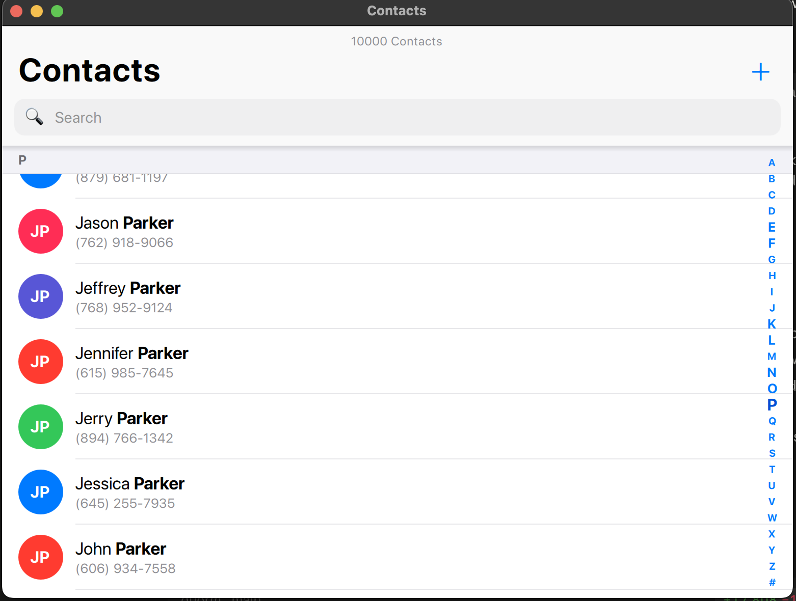

# Tutorial — an iOS-style Contacts app with windowed fetching

Build a Qt Quick Contacts screen that looks and feels like iOS, backed entirely
by SQLite through Qivot. It holds **10,000 contacts** but only ever *fetches the
pages you scroll to* — so the whole table never lives in memory, yet the
scrollbar, sticky A–Z sections, and jump-to-letter index all work.



By the end you'll understand:

- how to expose a **`QiWindowedListModel`** to QML,
- how it counts once but fetches pages (`LIMIT/OFFSET`) on demand,
- how to build an A–Z jump that loads *nothing* (offsets come from `count(*)`),
- and how the QML `ListView` turns model roles into a sectioned, scrollable UI.

> **Run it first**
> ```sh
> cd examples/contacts
> qmake && make
> ./contacts
> ```
> `contacts.db` is dropped and re-seeded on every launch. Set `QIVOT_LOG=1` to
> print every SQL statement and watch the paging happen.

---

## Step 1 — Define the model

A contact is a plain class. Declare the fields, then register the table and its
columns with one macro. No SQL, no `QObject`.

```cpp
// contact.h
class Contact : public QiModel {
    QI_MODEL
public:
    QiField<QString> firstName;
    QiField<QString> lastName;
    QiField<QString> phone;
};
QI_DECLARE_MODEL(Contact, "contact",
                 QI_FIELD(firstName), QI_FIELD(lastName), QI_FIELD(phone));
```

`QI_DECLARE_MODEL` also generates typed column descriptors — `Contact::col().lastName`
— which we'll use to build queries later.

## Step 2 — Create the table and seed it

Open a connection, create the table, then insert 10,000 rows in one batched
transaction with a `QiListWriter`. The names are 100 first names × 100 surnames
enumerated as every distinct pair, so all 10,000 are unique.

```cpp
// main.cpp (abridged)
QiConnection connection;
connection.open(db);
connection.addModel<Contact>();
connection.createTables();

QiList<Contact> seed;
QiListWriter writer(&seed);
for (int i = 0; i < 10000; i++) {
    writer << firsts.at(i % firsts.size())        // firstName
           << lasts.at(i / firsts.size())         // lastName
           << phoneFor(i)                          // phone
           << writer.next();                       // commit this row
}
seed.save();                                        // one transaction
```

## Step 3 — Expose a *windowed* model to QML

Here's the key idea. Instead of loading all 10,000 rows, `ContactStore` wraps a
**`QiWindowedListModel`** and points it at an ordered query. The model runs one
`SELECT count(*)` up front (so it knows there are 10,000 rows) but fetches each
page only when the view asks for it.

```cpp
// contactstore.h — a QML-registered controller
class ContactStore : public QObject {
    Q_OBJECT
    QML_ELEMENT
    Q_PROPERTY(QAbstractItemModel *contacts READ contacts CONSTANT)
    Q_PROPERTY(QString filter READ filter WRITE setFilter NOTIFY filterChanged)
    Q_PROPERTY(int count READ count NOTIFY countChanged)
    // ...
private:
    QiWindowedListModel m_model;
    QString             m_filter;
};
```

```cpp
// contactstore.cpp
void ContactStore::rebuild() {
    m_model.setQuery<Contact>(buildBase(), 60);  // 60 rows per fetched page
    m_model.refresh();                           // count(*) + load page 1
}

QiQuery<Contact> ContactStore::buildBase() const {
    QiQuery<Contact> q = Contact::objects();
    if (!m_filter.trimmed().isEmpty()) {
        const QString like = "%" + m_filter.trimmed() + "%";
        q = q.filter( Contact::col().lastName.expr("like", like)
                   || Contact::col().firstName.expr("like", like) );
    }
    return q.orderBy(QStringList() << "lastName asc" << "firstName asc");
}
```

Because `count()` reports the true total, the QML `ListView` gets a correct
`rowCount` — its scrollbar and section headers behave as if all 10,000 rows were
present, even though only a couple of pages are.

With `QIVOT_LOG=1`, launch prints exactly this:

```
SELECT count(*) FROM contact ORDER BY lastName asc, firstName asc ;
SELECT * FROM contact ORDER BY lastName asc, firstName asc LIMIT 60 ;
```

One count, one page — never a bulk `SELECT *`.

## Step 4 — Jump to a letter without loading everything

The A–Z rail needs the *row offset* where each letter begins. That offset is
simply the number of contacts that sort before it — another `count(*)`:

```cpp
int ContactStore::indexForLetter(const QString &letter) const {
    const QChar target = letter.at(0).toUpper();
    // rows that sort before this letter == the offset of its first row
    QiWhere where = Contact::col().lastName.expr("<", QString(target));
    // (AND the search filter, if any)
    return Contact::objects().filter(where).count();
}
```

QML calls `positionViewAtIndex(offset, …)`; the view scrolls there and the
target page is fetched on demand. No rows in between are ever loaded.

## Step 5 — Read any row for the scroll HUD

The floating "you are here" HUD needs the name at the top of the viewport. The
windowed model can hand back any field at any row, fetching that row's page if
it isn't cached — no full-list scan:

```cpp
QString ContactStore::nameForIndex(int row) const {
    return (m_model.valueAt(row, "firstName").toString() + " " +
            m_model.valueAt(row, "lastName").toString()).trimmed();
}
```

## Step 6 — Build the QML UI

Bind a `ListView` to the model. Each declared field is exposed as a **role**, so
the delegate reads `firstName`, `lastName`, `phone` directly. Section on the
`lastName` role with `ViewSection.FirstCharacter` for sticky A–Z headers.

```qml
ContactStore { id: store }

ListView {
    id: list
    model: store.contacts
    section.property: "lastName"
    section.criteria: ViewSection.FirstCharacter
    section.delegate: Rectangle { /* the A / B / C header */ }
    delegate: Rectangle {
        // roles come straight from the model's fields:
        Text { text: firstName + " <b>" + lastName + "</b>"; textFormat: Text.StyledText }
        Text { text: phone }
    }
    ScrollBar.vertical: ScrollBar { policy: ScrollBar.AlwaysOn }
}
```

The rest of `main.qml` layers on the polish: the A–Z rail (`onPressed`/
`onPositionChanged` → `store.indexForLetter`), the current-position HUD
(`store.sectionForIndex` / `nameForIndex`), avatar initials, the search field
(`store.filter = text`), and an add dialog.

## Step 7 — Reactive add

Adding a contact just `save()`s it — a `QiConnection` change hook re-counts the
window so it shows up in its section:

```cpp
void ContactStore::add(const QString &f, const QString &l, const QString &p) {
    Contact c; c.firstName = f; c.lastName = l; c.phone = p;
    c.save();   // the change hook calls m_model.refresh()
}
```

---

## Files

| File | Role |
|---|---|
| `contact.h` | The `Contact` model — `firstName`, `lastName`, `phone`. |
| `contactstore.h` / `.cpp` | QML controller: windowed model, search filter, `indexForLetter`, add/remove. |
| `main.cpp` | Opens the DB, seeds 10,000 unique contacts, loads the QML. |
| `main.qml` | The iOS-style UI: header, search, sectioned `ListView`, A–Z rail, HUD, add dialog. |

## Environment variables

- `QIVOT_LOG=1` — print every SQL statement (see the paging happen).
- `QIVOT_SEED=<n>` — seed a different number of contacts (capped at the number of
  unique first×last pairs, 10,000).
- `QIVOT_SELFTEST=1` — run a scripted add / search / jump and quit, for headless
  checks (`QT_QPA_PLATFORM=offscreen ./contacts`).

## See also

- [`infinitescroll`](../infinitescroll) — the other paging strategy:
  *append-on-scroll* with `QiLazyListModel`, for an endless feed.
- [`reactive`](../reactive) — live models that refresh themselves on any write.
