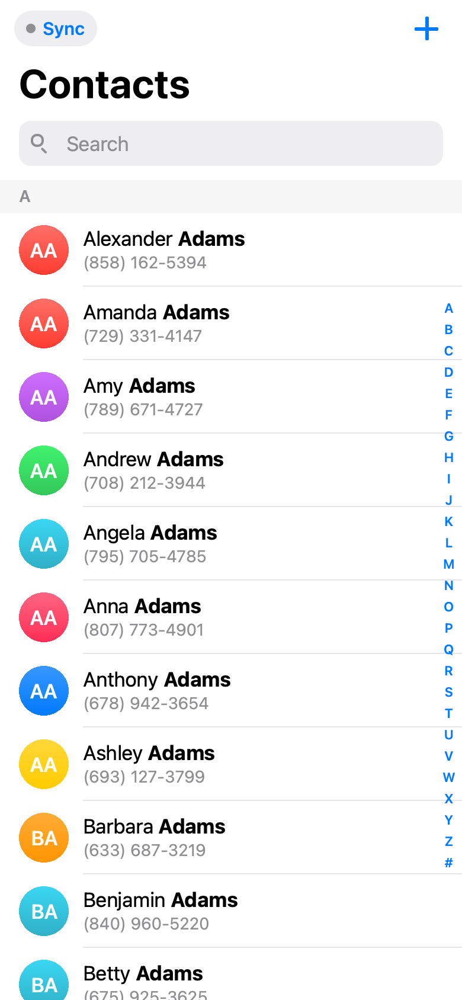
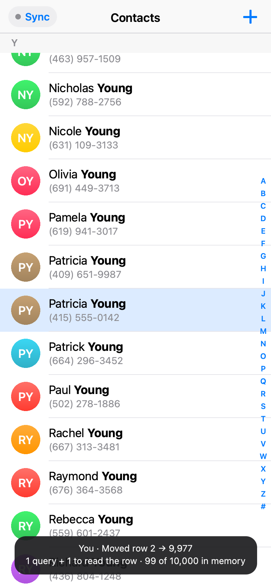
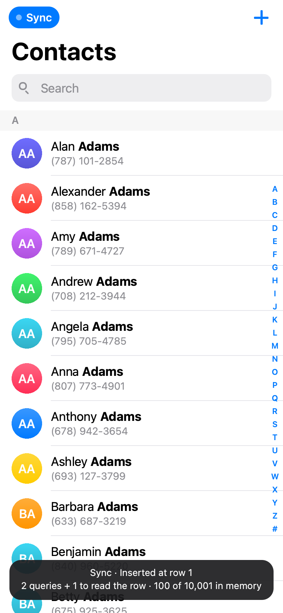
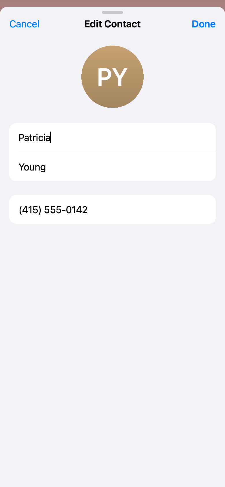

# Tutorial — a live iOS-style Contacts app over 10,000 records

Build a Qt Quick Contacts screen that looks and feels like iOS, backed by SQLite
through Qivot. It holds **10,000 contacts**, and it stays live: rename someone and
their row glides to its new place, add someone and they slide in, delete someone
and the row folds away. The list is never reloaded to do it. Each change costs one
small query and reaches the view as one row signal, the way iOS's
`NSFetchedResultsController` drives a table view.

<table>
<tr>
<td></td>
<td></td>
<td></td>
</tr>
<tr>
<td align="center">10,000 contacts, read as ids</td>
<td align="center">A rename: row 2 moved to 9,977</td>
<td align="center">Sync: a new contact slides in</td>
</tr>
</table>

By the end you'll know how to:

- put a **`QiLiveListModel`** behind a QML `ListView`;
- see what it keeps in memory (the ids) and what it reads (the rows on screen);
- edit, add and delete, and have only that row change;
- animate those changes like a table view;
- show what each change cost, using the model's row signals and the
  connection's row-level change hook;
- react to changes made somewhere else (here, a simulated sync);
- search, jump to a letter and read any row without loading the list.

> **Run it first**
> ```sh
> cd examples/contacts
> qmake && make
> ./contacts
> ```
> The first launch seeds 10,000 contacts into `contacts.db`; after that your
> changes persist. Set `QIVOT_LOG=1` to print every SQL statement and watch what
> each change costs. Tap **Sync** in the corner to have the rows on screen change
> by themselves.
>
> It also runs on **iOS and Android** (Qt 6.8+): build with that platform's
> `qmake` as usual. On a phone the database lives in the app's data directory.

---

## Step 1 — Define the model

A contact is a plain class. Declare the fields, then register the table and its
columns with one macro. No SQL, no `QObject`.

```cpp
// contact.h
class Contact : public QiModel {
    QI_MODEL
public:
    QiField<QString> firstName;
    QiField<QString> lastName;
    QiField<QString> phone;
};
QI_DECLARE_MODEL(Contact, "contact",
                 QI_FIELD(firstName), QI_FIELD(lastName), QI_FIELD(phone));
```

`QI_DECLARE_MODEL` also generates typed column descriptors, like
`Contact::col().lastName`, which the queries below use.

## Step 2 — Create the table and seed it

Open a connection, create the table, then insert 10,000 rows in one transaction
with a `QiListWriter`. The names are 100 first names × 100 surnames, every pair
once, so all 10,000 are different.

```cpp
// main.cpp (abridged)
QiConnection connection;
connection.open(db);
connection.addModel<Contact>();
connection.createTables();

QiList<Contact> seed;
QiListWriter writer(&seed);
for (int i = 0; i < 10000; i++) {
    writer << firsts.at(i % firsts.size())        // firstName
           << lasts.at(i / firsts.size())         // lastName
           << phoneFor(i)                          // phone
           << writer.next();                       // commit this row
}
seed.save();                                        // one transaction
```

## Step 3 — Put a live model behind the list

`ContactStore` is the controller QML talks to. It owns a **`QiLiveListModel`**
and points it at an ordered query:

```cpp
// contactstore.h — a QML-registered controller
class ContactStore : public QObject {
    Q_OBJECT
    QML_ELEMENT
    Q_PROPERTY(QAbstractItemModel *contacts READ contacts CONSTANT)
    Q_PROPERTY(QString filter READ filter WRITE setFilter NOTIFY filterChanged)
    Q_PROPERTY(int count READ count NOTIFY countChanged)
    Q_PROPERTY(QString activity READ activity NOTIFY activityChanged)
    // ...
private:
    QiLiveListModel m_model;
};
```

```cpp
// contactstore.cpp
QiQuery<Contact> ContactStore::buildBase() const {
    QiQuery<Contact> q = Contact::objects();
    // (the search filter goes here: Step 10)
    return q.orderBy(QStringList() << "lastName asc" << "firstName asc");
}

void ContactStore::rebuild() {
    m_model.setQuery<Contact>(buildBase(), 60);   // read records 60 at a time
}
```

That is the whole setup. `setQuery()` runs **one** query, for the ids only, in
the list's order. With `QIVOT_LOG=1`, launch prints:

```
SELECT ALL contact.id FROM contact ORDER BY lastName asc,firstName asc,contact.id ;   2.26ms
SELECT ALL * FROM contact WHERE id in (:arg0, … :arg59) ;
```

The second query comes from the view: it asked for the rows it is about to draw,
and the model read those 60 records by id. Scroll, and it reads the next 60 when
you reach them. At most 2,000 records are kept (`setMaxCachedRecords()` changes
that); the rest of the list is just 10,000 ids.

`contact.id` is added to the end of the order, so two contacts with the same name
still have a fixed order. The model needs that to tell where a row belongs.

## Step 4 — Bind it in QML

Each field of the model is a **role**, so the delegate reads `firstName`,
`lastName` and `phone` directly. Sectioning on `lastName` gives the sticky A–Z
headers.

```qml
ContactStore { id: contactStore }

ListView {
    id: list
    model: contactStore.contacts
    section.property: "lastName"
    section.criteria: ViewSection.FirstCharacter
    section.delegate: Rectangle { /* the A / B / C header */ }

    delegate: SwipeDelegate {
        readonly property int contactId: model.id
        contentItem: Item {
            Avatar { first: firstName; last: lastName }
            Text { text: firstName + " <b>" + lastName + "</b>"; textFormat: Text.StyledText }
            Text { text: phone }
        }
        onClicked: stack.push(detailPage, { contactId: model.id, firstName: firstName,
                                            lastName: lastName, phone: phone })
    }
}
```

`rowCount()` is the full 10,000 from the start, so the scrollbar and the sections
behave as if every row were loaded.

## Step 5 — Edit a contact, and only its row changes

The card a row opens has an **Edit** button. It opens the same sheet as **+**,
filled in, and **Done** calls the store:



```cpp
void ContactStore::update(int id, const QString &firstName, const QString &lastName,
                          const QString &phone) {
    Contact c;
    if (!c.load(Contact::col().id == id))
        return;
    c.firstName = firstName.trimmed();
    c.lastName  = lastName.trimmed();
    c.phone     = phone.trimmed();
    c.save();               // that's all: the list updates the one row
}
```

The store doesn't tell the list anything. `save()` tells the **connection**
"contact 4144 was updated", and the model watching that table works out what that
means for the list. In the screenshots, Amanda Adams (row 2) became Patricia
Young, which belongs at row 9,977:

```
UPDATE contact SET firstName = :firstName, lastName = :lastName, phone = :phone WHERE id = :id      the save
SELECT qi_rn FROM (SELECT ALL contact.id AS qi_id,
                          ROW_NUMBER() OVER (ORDER BY lastName asc, firstName asc, contact.id) AS qi_rn
                   FROM contact) qi_pos
WHERE qi_id = :qi_id ;                                              where it belongs now: 9,977
```

The model emits **one `rowsMoved`** from row 2 to row 9,977. Nothing else is
re-read, and the view keeps every delegate it has and its scroll position. Then,
because the record changed, the model drops its copy, and the next time the view
draws that row it reads the one record again.

<br clear="right">

The same query answers every kind of save:

| The record… | `ROW_NUMBER()` says | The view gets |
|---|---|---|
| stays where it was (a new phone number) | the same row | `dataChanged` for that row |
| belongs somewhere else (a new name) | a different row | `rowsMoved` |
| no longer matches the filter | nothing | `rowsRemoved` |
| wasn't in the list but now matches | a row | `rowsInserted` |

When you come back to the list, it scrolls to where the contact went and flashes
the row (`main.qml`, `StackView.onActivated`), which is the second screenshot.

## Step 6 — Animate the changes

Because the model only ever inserts, removes and moves rows, never resets, a
`ListView` can animate every change. These three transitions give the table-view
feel:

```qml
ListView {
    // a new row slides in from the right
    add: Transition {
        NumberAnimation { property: "opacity"; from: 0; to: 1; duration: 260 }
        NumberAnimation { property: "x"; from: list.width * 0.25; to: 0; duration: 300; easing.type: Easing.OutCubic }
    }
    // a deleted one slides out to the left
    remove: Transition {
        NumberAnimation { property: "opacity"; to: 0; duration: 220 }
        NumberAnimation { property: "x"; to: -list.width * 0.3; duration: 240; easing.type: Easing.InCubic }
    }
    // and the rows around them close up or make room
    displaced: Transition {
        NumberAnimation { properties: "x,y"; duration: 260; easing.type: Easing.OutCubic }
    }
}
```

With a model that resets, these never run: a reset throws every delegate away.

## Step 7 — Add and delete

Both are just the Qivot calls:

```cpp
void ContactStore::add(const QString &firstName, const QString &lastName,
                       const QString &phone) {
    Contact c;
    c.firstName = firstName.trimmed();
    c.lastName  = lastName.trimmed();
    c.phone     = phone.trimmed();
    c.save();                                    // the list inserts the one row
}

void ContactStore::remove(int id) {
    Contact c;
    if (c.load(Contact::col().id == id))
        c.remove();                              // the list removes the one row
}
```

A new contact costs two queries: its row (`ROW_NUMBER()`), and a `count(*)`.
The count is a safety check: if something else changed the table at the same
time (a raw `REPLACE`, another process), the numbers won't add up, and the model
reads the ids again rather than show a row that's gone.

A deletion costs **no query at all**. The model knows the id, so it knows the row.

## Step 8 — Show what each change cost

The dark pill at the bottom of the screen says what the last change did. It's
built from two things anyone can use.

**The model's row signals.** These are the standard `QAbstractItemModel`
signals, the same ones the `ListView` listens to:

```cpp
connect(&m_model, &QAbstractItemModel::rowsMoved, this,
        [this](const QModelIndex &, int start, int, const QModelIndex &, int dest) {
    const int to = dest > start ? dest - 1 : dest;    // Qt counts dest before the move
    note(QString("Moved row %1 → %2").arg(rowText(start), rowText(to)));
});
// … rowsInserted, rowsRemoved and dataChanged the same way
```

**The connection's row-level change hook**, which fires the moment a record is
written, before the model has done anything about it. That's where the store
notes the model's `queryCount()`, so the difference afterwards is what the
change cost:

```cpp
m_hookId = QiConnection::defaultConnection().addRowChangeHook([this](const QiChange &change) {
    // change.table == "contact", change.kind == QiChange::Updated, change.id == 4144
    m_queriesBefore = m_model.queryCount();
});
```

`QiChange::kind` is `Inserted`, `Updated`, `Removed`, or `Many` for a bulk
write. Your own code can watch it the same way to keep a badge count, a cache
or a search index up to date.

## Step 9 — Changes from somewhere else

The list doesn't care who made a change, only that it went through the
connection. Tap **Sync** and, every 1.4 seconds, the store changes one of the
contacts on screen the way another device syncing would: a new number, a new
surname, a relative with the same surname, or a deletion.

```qml
Timer {
    interval: 1400; repeat: true; running: win.syncing
    onTriggered: {
        var first = list.indexAt(list.width / 2, list.contentY + 40);
        var last  = list.indexAt(list.width / 2, list.contentY + list.height - 40);
        contactStore.simulateChange(first, last);   // one of the rows you can see
    }
}
```

```cpp
void ContactStore::simulate(const QString &kind, int row) {
    Contact c;
    c.load(Contact::col().id == m_model.idAt(row));
    if (kind == "phone")         { c.phone = randomPhone(); c.save(); }       // refreshed in place
    else if (kind == "rename")   { c.lastName = someSurname(); c.save(); }    // moves away
    else if (kind == "relative") { Contact r; r.firstName = …; r.lastName = c.lastName.get().toString();
                                   r.save(); }                                // slides in next to it
    else if (kind == "remove")   { c.remove(); }                              // folds away
}
```

In a real app this is your sync code, a background import or a second window.
Writes made on the same connection reach the list. Changes made with raw SQL or
by another process don't: call `connection.notifyChanged("contact")` or the
model's `refresh()` after those. Either one reads the ids again and signals only
the differences.

Several writes in one turn of the event loop are worked out together. A bulk
write (`Contact::objects().filter(…).update({…})`, a batch `QiList::save()`) is
reported as "many rows", so the model reads the id column again (one query) and
signals only the differences between the two lists.

## Step 10 — Search

Search is a new query, so it is the one time the list does reset: a different
set of contacts, read as ids.

```cpp
void ContactStore::setFilter(const QString &text) {
    m_filter = text;
    rebuild();                    // setQuery() again, with the filter in buildBase()
}

// in buildBase():
const QString like = "%" + m_filter.trimmed() + "%";
q = q.filter( Contact::col().lastName.expr("like", like)
           || Contact::col().firstName.expr("like", like) );
```

```
SELECT ALL contact.id FROM contact WHERE (lastName like :arg0) or (firstName like :arg1)
       ORDER BY lastName asc,firstName asc,contact.id ;       0.79ms
```

The filtered list is just as live. A contact renamed out of the search
disappears, and one renamed into it appears, because the `ROW_NUMBER()` query
runs with the same filter.

## Step 11 — Jump to a letter, read any row

The A–Z rail needs the row where each letter begins: the number of contacts that
sort before it, which is a `count(*)`, not a scan:

```cpp
int ContactStore::indexForLetter(const QString &letter) const {
    QiWhere where = Contact::col().lastName.expr("<", letter.left(1).toUpper());
    return Contact::objects().filter(where).count();      // (AND the search, if any)
}
```

QML calls `list.positionViewAtIndex(row, ListView.Beginning)`, and the model
reads the batch for those rows when the view draws them.

The floating "you are here" HUD needs the name at any row. `valueAt()` reads that
row's batch if it isn't in memory:

```cpp
QString ContactStore::nameForIndex(int row) const {
    return (m_model.valueAt(row, "firstName").toString() + " " +
            m_model.valueAt(row, "lastName").toString()).trimmed();
}
```

`idAt(row)` and `indexOf(id)` go the other way, between rows and ids, without
any query. `contactAt(row)` and `rowOf(id)` in the store wrap them for QML.

---

## Which list model?

| Model | Holds | A change costs | Use it for |
|---|---|---|---|
| `QiListModel` + `setLive()` | every record | re-running the query; only the differences reach the view | a few hundred rows |
| **`QiLiveListModel`** | the ids, plus the records on screen | one small query, one row signal | thousands of rows that change |
| `QiWindowedListModel` | the pages on screen | a `refresh()`: re-count and reload | large lists that are read-only |
| `QiLazyListModel` | the pages scrolled so far | a `reset()` | endless feeds, append-only |

`QiLiveListModel` finds rows with window functions: SQLite 3.25+, MySQL 8,
MariaDB 10.2+, PostgreSQL or SQL Server. On older servers, and for queries with a
limit, offset, `DISTINCT` or `GROUP BY`, each change reads the ids again instead.
That's still one column, and the view still gets only the differences.

## Files

| File | Role |
|---|---|
| `contact.h` | The `Contact` model: `firstName`, `lastName`, `phone`. |
| `contactstore.h` / `.cpp` | QML controller: the live model, search, add / edit / remove, the activity read-out, simulated sync, `indexForLetter`. |
| `main.cpp` | Opens the DB, seeds 10,000 contacts on first launch, loads the QML; the self-test and screenshot runs. |
| `main.qml` | The list screen: collapsing large title, search, sectioned `ListView` with row animations and swipe-to-delete, Sync, the activity pill, A–Z rail, HUD. |
| `ContactDetail.qml` | The card a row opens: avatar, message / call, phone, Edit, delete with confirmation. |
| `AddSheet.qml` | The "New Contact" / "Edit Contact" bottom sheet, with a live monogram. |
| `Avatar.qml` | Gradient monogram avatar, colored per name. |
| `safearea.h` / `safearea_ios.mm` | iOS only: reads the status-bar / home-indicator insets from UIKit. |

## Environment variables

- `QIVOT_LOG=1` — print every SQL statement, to see what each change costs.
- `QIVOT_SEED=<n>` — wipe and re-seed with a different number of contacts (at
  most 10,000, the number of distinct first × last pairs).
- `QIVOT_SELFTEST=1` — check that a rename, an add and a delete each reach the
  view as one row signal and never a reset, then quit
  (`QT_QPA_PLATFORM=offscreen ./contacts`).
- `QIVOT_SHOTS=<dir>` — walk through an edit and a sync and save the screenshots
  above (`QT_QPA_PLATFORM=offscreen QT_SCALE_FACTOR=2 QIVOT_SEED=10000 QIVOT_SHOTS=screenshots ./contacts`).

## See also

- [`reactive`](../reactive) — `QiListModel`'s live mode, for small lists.
- [`infinitescroll`](../infinitescroll) — append-on-scroll with `QiLazyListModel`.
- The main README's [Large live lists](../../README.md#large-live-lists-qilivelistmodel) section.
