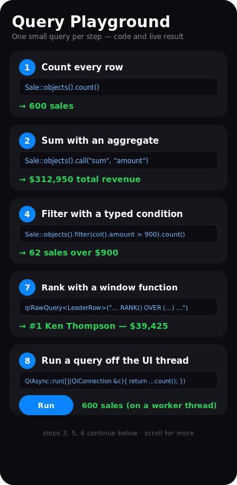

# Tutorial — an analytics dashboard (window functions + async)

A Qt Quick sales dashboard that showcases several of Qivot's later features in
one app:

- **`qiRawQuery`** — a `WITH` CTE + `RANK()` / running-`SUM()` **window functions**
  the typed builder can't express, mapped back into typed rows for a leaderboard.
- **`QiAsync` + `QiConnectionPool` + `QiCancelToken`** — a heavy "Recompute" job
  runs on a background thread with its own pooled connection, shows a live
  progress bar, and can be **cancelled** mid-flight.



*(stylized mockup — run it for the live leaderboard + async progress)*

> **Run it**
> ```sh
> cd examples/dashboard
> qmake && make
> ./dashboard
> ```

---

## Leaderboard — window functions via `qiRawQuery`

Per-customer revenue, ranked, with a running cumulative total — one query the
query builder can't express, run raw and mapped into typed `LeaderRow` objects:

```cpp
QiList<LeaderRow> rows = qiRawQuery<LeaderRow>(
    "WITH totals AS ("
    "  SELECT customer AS cid, SUM(amount) AS total, COUNT(*) AS orders"
    "  FROM sale GROUP BY customer) "
    "SELECT c.name AS name, t.total AS total, t.orders AS orders, "
    "       RANK() OVER (ORDER BY t.total DESC) AS rnk, "
    "       SUM(t.total) OVER (ORDER BY t.total DESC "
    "                          ROWS BETWEEN UNBOUNDED PRECEDING AND CURRENT ROW) AS running "
    "FROM totals t JOIN customer c ON c.id = t.cid ORDER BY t.total DESC");
```

`LeaderRow` is a plain `QiModel` whose fields (`name`, `total`, `orders`, `rnk`,
`running`) match the result columns — it's never a table, just a typed carrier
for the query. The QML renders it as a ranked list with medals, share-of-total
bars, and the running total.

## Recompute — async, pooled, cancellable

Pressing **Recompute** kicks off a heavy job on Qt's thread pool. Each worker
thread gets its own connection from a `QiConnectionPool` (configured once), and
the job checks a `QiCancelToken` so **Cancel** stops it cleanly:

```cpp
QiAsync::configure("QSQLITE", "dashboard.db");

QFuture<int> f = QiAsync::runCancelable(m_token,
    [prog](QiConnection &c, const QiCancelToken &token) -> int {
        for (int i = 0; i < 100; i++) {
            if (token.isCanceled()) return -1;          // cooperative cancel
            (void) Sale::objects(c).call("sum", "amount");   // real work, worker connection
            QThread::msleep(25);
            prog->store((i + 1));                        // report progress
        }
        return 100;
    });
```

A `QTimer` on the GUI thread polls the shared progress counter to drive the bar,
and a `QFutureWatcher` reports completion. The whole time, the UI stays
responsive — the pulsing dots keep animating, and Cancel works instantly.

- **Needs** `QT += concurrent` and a **file-based** database (worker threads open
  their own connection to it; a `:memory:` DB is private per connection). WAL is
  enabled so the worker's reads don't contend with the main connection.

## What it demonstrates

- **`qiRawQuery<T>`** — CTEs + window functions → typed models.
- **`QiConnectionPool`** — one connection per worker thread.
- **`QiAsync::runCancelable` + `QiCancelToken`** — off-thread work with progress
  and cooperative cancellation, without freezing the UI.

## Files

| File | Role |
|---|---|
| `models.h` | `Customer`, `Sale`, and the `LeaderRow` view-model. |
| `dashboardstore.h` / `.cpp` | QML controller: the leaderboard query + the async recompute. |
| `main.cpp` | Opens a file DB, seeds customers and sales, loads the QML. |
| `main.qml` | The two-tab UI: window-function leaderboard + async progress/cancel. |

## See also

- [`keyset`](../keyset) / [`asyncquery`](../asyncquery) — the paging and async
  primitives, in focused console form.
- [`manytomany`](../manytomany) — relations (one-to-many + many-to-many) in QML.
