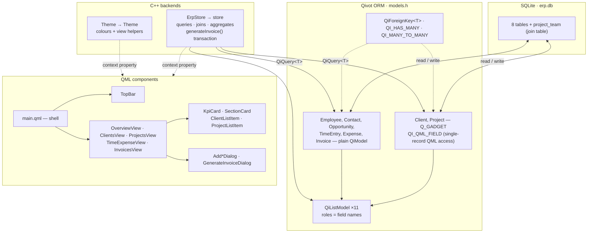
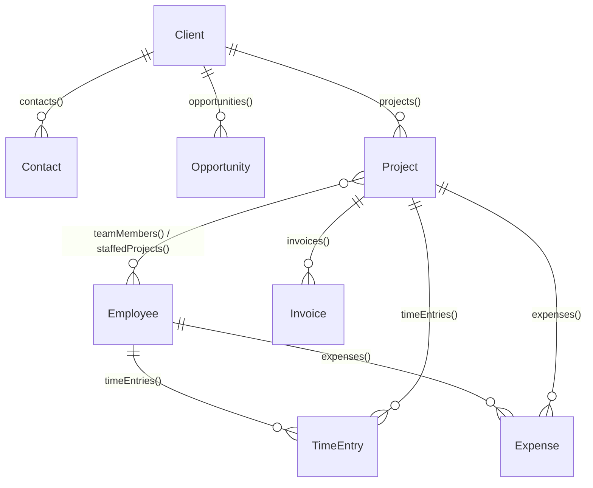

# Tutorial — Qivot ERP: CRM, projects, time & billing

A small but real **professional-services ERP/PSA** — the kind of system an
architecture, engineering, or consulting firm runs on: a **CRM** (companies,
contacts, and a sales pipeline), **projects** staffed by employees, **time &
expense** tracking, and **invoicing** that turns unbilled work into a bill with
one click. Five views, **eight related models**, and — deliberately — every
relation shape Qivot offers: `QiForeignKey` (child → parent, auto-loading),
`QI_HAS_MANY` (parent → children, the reverse), and `QI_MANY_TO_MANY` (a join
table with add/remove/toggle). **All data is synthetic**, generated at startup;
there are no real companies, people, or invoices.

> **Run it**
> ```sh
> cd examples/erp
> qmake && make
> ./erp
> ```

Set `QIVOT_SELFTEST=1` to skip the UI and just seed + print row counts — useful
for CI or for checking the schema compiles and seeds correctly without a display:
```sh
QIVOT_SELFTEST=1 ./erp
# Erp seeded: 14 clients, 16 projects, 1440 time entries, 218 expenses, 74 invoices
# Open opportunities: 17, Active projects: 8
```

## Architecture at a glance



Data flows **up**: SQLite → Qivot models (wired together with real relations,
not just integer columns) → `ErpStore` turns queries into `QiListModel`s and
gadget values → exposed to QML as the `store` context object. `main.qml`
composes the five views; the views compose reusable cards and dialogs. Nothing
in QML copies rows by hand.

## The schema — eight models, three kinds of relation

This is the part of the example that's worth reading closely: every foreign key
here is a real `QiForeignKey<T>`, not a bare `int`, and every "give me the
children of this row" query is a declared `QI_HAS_MANY` relation, not a
hand-written `QiWhere`. One relationship — project staffing — is a genuine
many-to-many across a join table.



### `QiForeignKey<T>` — the "one" side, with auto-loading

A `QiForeignKey<T>` field stores the same integer a plain `int` column would,
but it **remembers what it points to**: the first time you dereference it with
`->`, it loads the parent row for you — no manual "look up the client by id"
query.

```cpp
// Project — client and manager are both QiForeignKey fields
class Project : public QiModel {
    Q_GADGET
    QI_MODEL
    QI_QML_FIELD(QString, code)
    QI_QML_FIELD(QString, name)
    QI_QML_FIELD(Erp::ProjectStatus, status)
    QI_QML_FIELD(QString, startDate)
    QI_QML_FIELD(double,  budget)
public:
    QiForeignKey<Client>   client;     // -> client(id)
    QiForeignKey<Employee> manager;    // -> employee(id)

    QI_HAS_MANY(TimeEntry, timeEntries, "project")
    QI_HAS_MANY(Expense,   expenses,    "project")
    QI_HAS_MANY(Invoice,   invoices,    "project")
    QI_MANY_TO_MANY(Employee, teamMembers, "project_team")
};
```

```cpp
// generateInvoice() — a one-shot action, so auto-load is the right call here:
for (int i = 0; i < tes.size(); i++)
    total += tes.at(i)->hours.get().toDouble()
           * tes.at(i)->employee->billRate.get().toDouble();   // -> loads Employee, once
```

### `QI_HAS_MANY` — the reverse direction, composable

The parent side gets an accessor back: "every child row whose foreign key
points at me." It returns a normal `QiQuery<Child>`, so you chain `.orderBy()`,
`.count()`, or `.all()` on it exactly like any other query:

```cpp
// Client — three reverse relations, one per child table
class Client : public QiModel {
    Q_GADGET
    QI_MODEL
    QI_QML_FIELD(QString, name)
    QI_QML_FIELD(QString, industry)
    QI_QML_FIELD(QString, city)
    QI_QML_FIELD(QString, state)
    QI_QML_FIELD(QString, phone)

    QI_HAS_MANY(Contact,     contacts,      "client")
    QI_HAS_MANY(Opportunity, opportunities, "client")
    QI_HAS_MANY(Project,     projects,      "client")
};
```

```cpp
// ErpStore::selectClient() — no hand-written QiWhere needed
Client *c = cl.at(0);
m_contacts.setList(c->contacts().orderBy("name asc").all());
m_opportunities.setList(c->opportunities().orderBy("stage desc, amount desc").all());
```

### `QI_MANY_TO_MANY` — a join table, both directions

`Project` and `Employee` are linked by a genuine many-to-many: **staffing** is a
separate, *declared* fact from **who has actually logged hours** (see the
[Two kinds of "team"](#two-kinds-of-team--a-worked-example) section below — this
distinction is the whole point of modeling it this way).

```cpp
// Project side
QI_MANY_TO_MANY(Employee, teamMembers, "project_team")
// Employee side (same join table, reversed)
QI_MANY_TO_MANY(Project, staffedProjects, "project_team")
```

```cpp
// ErpStore::toggleTeamMember() — add()/remove()/contains() over the join table
if (p->teamMembers().contains(*e)) p->teamMembers().remove(*e);
else                                p->teamMembers().add(*e);
```

### The remaining five models

`Employee`, `Contact`, `Opportunity`, `TimeEntry`, and `Expense` round out the
schema. Only `Client` and `Project` are ever shown to QML as a *single* gadget
record (`store.client`, `store.project`), so only those two need `Q_GADGET` +
`QI_QML_FIELD` — the rest are plain `QiModel` classes, which is enough for
`QiListModel` (roles come from field **reflection**, not from `Q_PROPERTY` — see
[How QML gets the data](#how-qml-gets-the-data-no-hand-mapping)):

```cpp
class Employee : public QiModel {              // plain QiModel — list-only, never a
    QI_MODEL                                   // single-record gadget, so no Q_GADGET needed
public:
    QiField<QString> name, title, email;
    QiField<double>  billRate;                 // $/hr charged to clients
    QiField<double>  costRate;                 // $/hr internal cost
    QiField<bool>    active;

    QI_HAS_MANY(TimeEntry, timeEntries, "employee")
    QI_HAS_MANY(Expense,   expenses,    "employee")
    QI_MANY_TO_MANY(Project, staffedProjects, "project_team")
};

class Contact : public QiModel {               // plain QiModel — list-only, never a
    QI_MODEL                                   // single-record gadget, so no Q_GADGET needed
public:
    QiForeignKey<Client> client;
    QiField<QString> name, title, email, phone;
};

class Opportunity : public QiModel {
    QI_MODEL
public:
    QiForeignKey<Client> client;
    QiField<QString> name;
    QiField<Erp::OppStage> stage;               // real enum, see below
    QiField<double> amount;
    QiField<QString> closeDate;
};

class TimeEntry : public QiModel {
    QI_MODEL
public:
    QiForeignKey<Project>  project;
    QiForeignKey<Employee> employee;
    QiField<QString> date;
    QiField<double>  hours;
    QiField<bool>    billable;
    QiField<QString> notes;
    QiField<int>     invoiceId;   // 0 = unbilled — a *plain* int, see the note below
};

class Expense : public QiModel {
    QI_MODEL
public:
    QiForeignKey<Project>  project;
    QiForeignKey<Employee> employee;
    QiField<QString> date;
    QiField<double>  amount;
    QiField<QString> category;
    QiField<bool>    billable;
    QiField<int>     invoiceId;   // same convention as TimeEntry
};

class Invoice : public QiModel {
    QI_MODEL
public:
    QiForeignKey<Client>  client;
    QiForeignKey<Project> project;
    QiField<QString> number, issueDate, dueDate;
    QiField<Erp::InvoiceStatus> status;
    QiField<double>  amount;
};
```

> **Why `invoiceId` is a plain `int`, not a `QiForeignKey<Invoice>`.** A
> `QiForeignKey` models a real "points at exactly one row" relationship.
> `invoiceId` is different: it's an **optional back-reference** that starts at
> `0` (meaning "not billed yet") and gets filled in later by
> `generateInvoice()`. Modeling an optional, filled-in-later reference as a
> required foreign key would be misleading — a plain sentinel int says exactly
> what it is.

### Enums, not magic strings

Every finite-set field is a real C++ enum, registered with `Q_ENUM_NS` so QML
sees named values too (`Erp.Won`, `Erp.Active`, `Erp.Paid`, …), not raw
integers or strings:

```cpp
namespace Erp {
Q_NAMESPACE
enum OppStage      { Lead = 0, Qualified = 1, Proposal = 2, Won = 3, Lost = 4 };
Q_ENUM_NS(OppStage)
enum ProjectStatus { Planning = 0, Active = 1, OnHold = 2, Completed = 3 };
Q_ENUM_NS(ProjectStatus)
enum InvoiceStatus { Draft = 0, Sent = 1, Paid = 2 };   // "Overdue" is derived, not stored
Q_ENUM_NS(InvoiceStatus)
}
```

Qivot stores a `QiField<enum>` in an `INTEGER` column, so the code stays
type-checked end to end: `o.stage = Erp::Won;` to set it,
`QiWhere("stage = ", int(Erp::Won))` to filter, `model.stage === Erp.Won` to
compare in QML.

## How QML gets the data (no hand-mapping)

Two different mechanisms, used for two different needs — and this example
deliberately uses **both**, so you can see when each one applies.

**Query results → `QiListModel`.** The roles come straight from the model's
declared fields via reflection (`QI_DECLARE_MODEL`'s field list), which is why
the five *list-only* models above don't need `Q_GADGET` at all:

```cpp
m_opportunities.setList(c->opportunities().orderBy("stage desc, amount desc").all());
```
```qml
Repeater { model: store.opportunities
    Text { text: modelData.name + " — " + store.money(model.amount) } }   // roles == field names
```

**The selected record → a raw gadget value.** `Client` and `Project` are the
only two models ever bound as a *single* record (`store.client`,
`store.project`), so only they carry `Q_GADGET` + `QI_QML_FIELD`:

```qml
Text { text: store.client.name + " · " + store.client.industry }
```

**The one wrinkle:** `Project.client` and `Project.manager` are
`QiForeignKey<T>`, not a QML-representable type, so `QI_QML_FIELD` can't wrap
them directly. `Project` adds two thin, hand-written, **read-only**
`Q_PROPERTY`s over the underlying foreign keys so `store.project.clientId`
still works from QML exactly as if it were a plain field:

```cpp
Q_PROPERTY(int clientId  READ clientIdRole)
Q_PROPERTY(int managerId READ managerIdRole)
...
int clientIdRole()  const { return client.get().toInt(); }
int managerIdRole() const { return manager.get().toInt(); }
```

This only matters for the **single-gadget** access path
(`store.project.clientId`). Rows read from a `QiListModel` (e.g.
`store.projects`) expose the *real* field name — `model.client`, not
`model.clientId` — because list roles come from reflection on the actual
`QiForeignKey` member, not from this compatibility `Q_PROPERTY`.

Joins and formatting that don't belong on every row — a client's name, a
project's code, a money string — are tiny invokables (`store.clientName(id)`,
`store.projectCode(id)`, `store.money(amount)`), not fields copied everywhere.

## How the UI is built (components)

The UI is **not** one giant file — it's ~25 small QML components composed by a
thin shell, following the same pattern as every other Qt Quick example in this
repo.

### 1. Two backends every component can see

```cpp
Theme theme;                       // colours + view helpers (theme.h)
ErpStore store;                    // data + queries + relations + transactions
engine.rootContext()->setContextProperty("Theme", &theme);
engine.rootContext()->setContextProperty("store", &store);
```

Any component, anywhere in the tree, just writes `store.projects`,
`store.generateInvoice(...)`, `Theme.accent`, `Theme.stageColor(model.stage)` —
no passing objects down through props.

### 2. The shell composes; five views crossfade

```qml
// main.qml
ApplicationWindow {
    property int tab: 0
    TopBar           { currentTab: tab; onSelect: tab = index }
    OverviewView     { currentTab: tab; onSwitchToProjects: tab = 2 }
    ClientsView      { currentTab: tab }
    ProjectsView     { currentTab: tab; onSwitchToInvoices: tab = 4 }
    TimeExpenseView  { currentTab: tab }
    InvoicesView     { currentTab: tab }
}
```

Each view owns its own index and animates itself based on the shared `tab` —
the shell doesn't choreograph anything:

```qml
// every *View.qml
property int currentTab: 0
readonly property int myIndex: 2          // 0=Overview 1=Clients 2=Projects 3=Time&Expense 4=Invoices
opacity: currentTab === myIndex ? 1 : 0
transform: Translate { x: currentTab === myIndex ? 0 : (currentTab < myIndex ? 28 : -28) }
```

### 3. Reusable cards take props; children report back with signals

```qml
// KpiCard.qml — used 15× across Overview and Projects
Rectangle { property string label; property var value; property color accent }
```
```qml
KpiCard { label: "Unbilled"; value: store.money(root.ov.unbilled); accent: "#8B5CF6" }
```

`ProjectsView` reports "take me to the Invoices tab" up to `main.qml` with a
signal, rather than reaching into the shell's state directly:

```qml
// ProjectsView.qml
signal switchToInvoices()
Text { text: "View all invoices ⟶"; MouseArea { onClicked: root.switchToInvoices() } }
```

### 4. Dialogs live with the view that opens them, and get reused across views

`AddTimeEntryDialog` and `AddExpenseDialog` are opened two different ways: from
a *specific* project's detail page (`lockProject: true`, the project is fixed
and shown as text) and from the firm-wide Time & Expense ledger
(`lockProject: false`, a `ComboBox` lets you pick any project):

```qml
// ProjectsView.qml — opened for the currently selected project
AddTimeEntryDialog { id: addTimeDialog; projectId: store.selectedProjectId; lockProject: true }
```
```qml
// TimeExpenseView.qml — same component, opened generically
AddTimeEntryDialog { id: addTimeDialog; lockProject: false }
```

## Two kinds of "team" — a worked example

`ProjectsView`'s detail page shows **two** team panels side by side, and they
can disagree — on purpose:

- **Assigned team** — the `QI_MANY_TO_MANY` staffing roster. A declared fact:
  "this person is staffed on this project." Tap a chip to toggle it; that's
  `QiRelationSet::add()`/`remove()` under the hood.
- **Hours logged** — purely *derived* from `TimeEntry` rows, grouped and
  summed in C++. Someone can log hours without being formally staffed (a
  principal covering one day), and someone can be staffed without having
  logged anything yet (a project that just kicked off).

```cpp
// ErpStore::selectProject() — both signals, computed side by side
QSet<int> assignedIds;
QiList<Employee> assigned = p->teamMembers().all();          // declared roster
for (...) assignedIds.insert(assigned.at(i)->id().toInt());

QHash<int, double> teamHours;                                  // derived from TimeEntry
for (...) teamHours[t->employee.get().toInt()] += t->hours.get().toDouble();
```

Try it: open a project, untoggle everyone from **Assigned team**, and watch
**Hours logged** stay exactly as it was — the two panels are backed by
completely different queries.

## The invoicing transaction (the important one)

Turning unbilled work into an invoice has to be **all-or-nothing**: create the
`Invoice` row, then stamp every included `TimeEntry`/`Expense` with its new
`invoiceId` — if any of that fails partway, nothing should be billed. That's a
textbook `QiTransaction`:

```cpp
bool ErpStore::generateInvoice(int projectId, const QString &dueDate) {
    QiTransaction txn;                                          // BEGIN

    QiList<TimeEntry> tes = QiQuery<TimeEntry>().filter(QiWhere("project = ", projectId)
        && QiWhere("billable = ", true) && QiWhere("invoiceId = ", 0)).all();
    QiList<Expense> exs = QiQuery<Expense>().filter(QiWhere("project = ", projectId)
        && QiWhere("billable = ", true) && QiWhere("invoiceId = ", 0)).all();

    if (tes.size() == 0 && exs.size() == 0) {
        txn.rollback();                                         // nothing to bill — undo, refuse
        m_lastError = "Nothing unbilled to invoice on this project.";
        return false;
    }

    double total = 0;
    for (...) total += t->hours.get().toDouble() * t->employee->billRate.get().toDouble();
    for (...) total += ex->amount.get().toDouble();

    Invoice inv; /* set fields */ inv.amount = total;
    if (!inv.save()) { txn.rollback(); return false; }          // save failed — undo

    for (...) { tes.at(i)->invoiceId = inv.id().toInt(); tes.at(i)->save(); }
    for (...) { exs.at(i)->invoiceId = inv.id().toInt(); exs.at(i)->save(); }

    txn.commit();                                                 // COMMIT — all or nothing
    return true;
}
```

Try it in the app: open a project with unbilled time (most **Active** ones
have some — seeding deliberately leaves the last ~18 days unbilled), click
**⟶ Generate invoice**. A new Draft invoice appears; the time entries it billed
now show "invoiced" in the Time & Expense ledger and can't be billed again.

## A documented gotcha: `.filter()` replaces, it doesn't AND

While building `generateInvoice()`, it's tempting to write
`project->timeEntries().filter(QiWhere("billable = ", true))`, chaining a
second filter onto the relation accessor's own query. **Don't** — `QiQuery::filter()`
*replaces* the query's `WHERE` clause rather than combining with it:

```cpp
QiSharedQuery QiSharedQuery::filter(QiWhere where) {
    QiSharedQuery query(*this);
    query.data->expression = QiExpression(where);   // assignment, not AND
    return query;
}
```

So `project->timeEntries().filter(...)` silently **drops** the relation's own
`"project = X"` condition — the second `.filter()` call would match every
`TimeEntry` in the whole table, not just this project's. `.orderBy()` and
`.limit()` are safe to chain (they set different fields), but when a second
*condition* is needed, combine everything into one `QiWhere` with `&&` instead,
which is exactly why `generateInvoice()` above is a hand-built query rather
than `project->timeEntries().filter(...)`.

## Caching vs. auto-load: two answers to the same question

The store needs "this employee's name" and "this employee's bill rate" in two
very different places, and uses two different strategies on purpose:

- **Rendering a list** (`store.projectTimeEntries`, `Overview`'s unbilled
  total) iterates potentially hundreds of rows per repaint. Looking up each
  employee via `QiForeignKey`'s auto-load there would mean one query *per row,
  per repaint* — a classic N+1. So `ErpStore` keeps small `QHash<int, …>`
  caches (`m_empName`, `m_empBillRate`, `m_empCostRate`), rebuilt once in
  `loadCaches()` whenever an employee changes.
- **`generateInvoice()`** runs once per click, over a small, already-filtered
  set of rows. There, `t->employee->billRate` (the real auto-load) is simpler
  and can't go stale the way a cache could — no N+1 concern for an action that
  fires once.

Same data, same underlying relation — the access pattern decides which one is
appropriate.

## What it shows off

| Feature | Where |
| --- | --- |
| **Eight related models, three relation kinds** | `QiForeignKey` (child→parent, auto-loading), `QI_HAS_MANY` (parent→children), `QI_MANY_TO_MANY` (join table) — [`models.h`](models.h) |
| **A transaction with a business rule** | `generateInvoice()` bills unbilled work atomically or not at all |
| **A toggleable many-to-many roster** | `Project.teamMembers()` / `Employee.staffedProjects()` — [`ProjectsView.qml`](ProjectsView.qml) |
| **Aggregate analytics** | `count()`, `SUM()` via `.select()` + `.groupBy()` for pipeline-by-stage, revenue-by-month, AR aging, top clients — [`erpstore.cpp`](erpstore.cpp) |
| **Real enums, not strings** | `Erp::OppStage`, `Erp::ProjectStatus`, `Erp::InvoiceStatus` — filtered, set, and compared as enums everywhere, in C++ and QML |
| **Writes from the UI** | add a client, contact, opportunity, project, time entry, or expense — each an `insert` that ripples to every affected view |
| **Filtered search** | client and project directories filter live with `LIKE` |
| **Status that ripples** | changing an opportunity's stage, a project's status, or an invoice's status refreshes every view that depends on it |

## Analytics with aggregates (the Overview tab)

```cpp
// pipeline value by stage — a GROUP BY, read row by row
QiQuery<Opportunity> q = QiQuery<Opportunity>()
    .select(QStringList() << "stage" << "count(*)" << "SUM(amount)").groupBy("stage");
if (q.exec()) while (q.next()) {
    stageCounts[q.value(0).toInt()] = q.value(1).toInt();
    stageValues[q.value(0).toInt()] = q.value(2).toDouble();
}

// revenue by month — SQLite's substr() on the stored "yyyy-MM-dd" string
QiQuery<Invoice> rq = QiQuery<Invoice>().filter(QiWhere("status <> ", int(Erp::Draft)))
    .select(QStringList() << "substr(issueDate,1,7) m" << "SUM(amount)").groupBy("m");
```

AR aging buckets and the unbilled total are computed in C++ from small,
already-filtered `QiList`s (not another `groupBy`) — with only a few hundred
open invoices/entries at a time, a linear scan over rows already fetched from
one query is simpler than another SQL round-trip, and just as fast.

## Try this in the app

1. **Overview** — firm-wide KPIs, a 6-month revenue chart, pipeline by stage,
   AR aging, and top clients — all aggregate queries, no hand-copied rows.
2. **Clients** — search, select a client, **＋ Add opportunity**, then drag its
   stage combo through Lead → Qualified → Proposal → Won and watch the
   Overview pipeline chart update.
3. **Projects** — select a project, toggle a couple of chips in **Assigned
   team**, and compare against **Hours logged** right below it (they won't
   match — see [Two kinds of "team"](#two-kinds-of-team--a-worked-example)).
   Then **＋ Log time**, **＋ Log expense**, and **⟶ Generate invoice**.
4. **Time & Expense** — filter the firm-wide ledger to one project with the
   project picker; entries already billed are marked "invoiced".
5. **Invoices** — filter by Draft / Sent / Overdue / Paid; **Send** a draft,
   then **Mark paid** — watch AR aging on the Overview tab shift.

## Files

**C++ backends** (exposed to QML as the `store` and `Theme` context objects):

| File | Role |
|---|---|
| `models.h` | The eight models, their relations, and the `Erp` enums (the schema). |
| `erpstore.h` / `.cpp` | All the queries, joins, and aggregates; the invoicing transaction; the team-toggle action. |
| `theme.h` / `.cpp` | Design tokens + view helpers (colours per stage/status, `initials`, `dateLabel`). |
| `main.cpp` | Opens the DB, seeds the synthetic firm (employees, clients, pipeline, projects, time, expenses, invoices, staffing), wires the context objects, loads the UI. |

**QML components** (each in its own file — the shell just composes them):

| File | Role |
|---|---|
| `main.qml` | The window shell: `TopBar` + the five views. |
| `TopBar.qml` | Brand, the sliding segmented tabs, the client/project count chip. |
| `OverviewView` / `ClientsView` / `ProjectsView` / `TimeExpenseView` / `InvoicesView` | The five tabs. |
| `KpiCard`, `SectionCard` | Reusable stat cards and content panels. |
| `ClientListItem`, `ProjectListItem` | Directory row delegates. |
| `AddClientDialog`, `AddContactDialog`, `AddOpportunityDialog`, `AddProjectDialog`, `AddTimeEntryDialog`, `AddExpenseDialog`, `GenerateInvoiceDialog` | The modals — `AddTimeEntryDialog`/`AddExpenseDialog` are reused from both `ProjectsView` and `TimeExpenseView` (see [§4](#4-dialogs-live-with-the-view-that-opens-them-and-get-reused-across-views)). |

Components access data through the global `store` and styling through `Theme`,
so there's no prop-drilling — each file stays small and focused.

## See also

- [`relations`](../relations) — `QiForeignKey` / `QI_HAS_MANY` in a smaller,
  more focused example.
- [`manytomany`](../manytomany) — `QI_MANY_TO_MANY` on its own, with a music
  library instead of a staffing roster.
- [`savepoints`](../savepoints) — nested transactions in depth.
- [`clinic`](../clinic) — the other full Qt Quick app example in this repo,
  with a booking transaction and full-text search.
