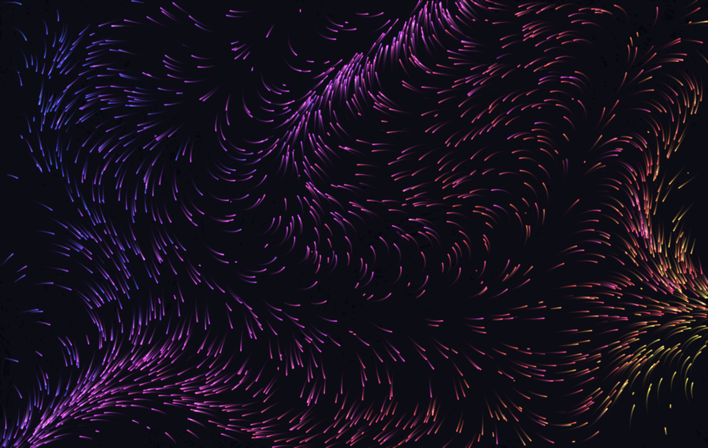

# Tutorial — Fluxo: writing to SQLite thousands of times a second (and replaying it)

New to databases? Perfect. This example is the friendly, visual way to understand
**writing lots of data fast** and **reading it back**. No prior SQL needed.



**What you're looking at:** thousands of glowing dots drifting across the screen,
leaving trails. That's the fun part. The *real* point is hidden underneath:

> Every dot's position is **saved into a database**, over and over, many times a
> second. Then you can **drag a slider to travel back in time** and watch any past
> moment — rebuilt entirely from what was saved.

Think of it like the **black box flight recorder** on a plane: it quietly writes
down everything, constantly, so you can replay it later.

> **Run it**
> ```sh
> cd examples/fluxo
> qmake && make
> ./fluxo
> ```

---

## The one big idea

A **database** is just a place to store rows of data on disk (SQLite keeps it all
in a single file — here, `fluxo.db`). Normally apps write to it now and then. Fluxo
writes to it *constantly* — and stays smooth while doing it. This tutorial shows
the handful of tricks that make that possible.

We'll go one small step at a time.

---

## Step 1 — Describe one row

First we tell Qivot what a single row looks like. One row = one particle at one
moment in time. It stores which **frame** it belongs to, its position (**x**, **y**),
and its color (**hue**):

```cpp
// sample.h
class Sample : public QiModel {
    QI_MODEL
public:
    QiField<int>    frame;   // which moment in time
    QiField<double> x;       // position on screen
    QiField<double> y;
    QiField<int>    hue;     // color, 0–359
};
QI_DECLARE_MODEL(Sample, "sample",
    QI_FIELD(frame), QI_FIELD(x), QI_FIELD(y), QI_FIELD(hue));
```

That's it — no SQL. Qivot turns this class into a table called `sample` for you.

> **What's a "frame"?** The screen redraws about **60 times a second**. Each redraw
> is one *frame*. Fluxo numbers them: frame 0, 1, 2, 3… Every frame, it saves *all*
> the particles with that frame number. So frame 42 is a complete snapshot of where
> everything was at that instant.

---

## Step 2 — Turn on "fast write" mode (WAL)

By default SQLite is careful but a little slow, and a writer can block readers. One
line switches on **WAL mode** ("write-ahead logging"), which is much faster for
lots of writes and lets the screen keep reading while we write:

```cpp
// main.cpp
connection.setJournalMode("WAL");
```

You don't need to understand *how* WAL works — just know it's the switch you flip
when an app writes a lot. That's the whole lesson here.

---

## Step 3 — Write a whole frame in one go (batching)

Here's the most important trick. Saving 1,800 particles as 1,800 separate saves
would be slow. Instead we collect them into one list and save the **whole batch at
once** — a single, efficient trip to the database:

```cpp
// fluxview.cpp — runs once per frame
QiList<Sample> batch;            // an empty list of rows
QiListWriter w(&batch);
for (int i = 0; i < particleCount; i++)
    w << frame << x[i] << y[i] << hue[i] << w.next();   // add one row

batch.save();                    // save ALL of them together
```

`w.next()` just means "that's the end of this row, start the next one." When the
loop finishes, `batch.save()` writes every row in one shot.

**Why it matters:** this is the difference between a smooth app and a stuttering
one. At 1,800 particles × 60 frames per second, that's about **100,000 rows saved
every second** — and the app never freezes. Watch the *writes/sec* number in the
app climb.

---

## Step 4 — Don't let the file grow forever (retention)

If we saved forever, `fluxo.db` would balloon to gigabytes. So after each frame we
delete the oldest one that's aged out of our ~23-second memory window:

```cpp
// keep only recent history; drop the frame that just fell out the back
QiQuery<Sample>().filter(QiWhere("frame < ", cutoff)).remove();
```

Now the file stays a sensible size, even though the *total number of rows we've
ever written* keeps climbing. (The app shows both numbers so you can see the
difference: "rows written" keeps rising; "rows in table" holds steady.)

---

## Step 5 — Replay: read a moment back out

This is the payoff. To show frame 42, we just ask the database for every row with
that frame number and draw them:

```cpp
// fluxview.cpp — when you drag the timeline
QiList<Sample> rows = QiQuery<Sample>().filter(QiWhere("frame = ", 42)).all();
for (int i = 0; i < rows.size(); i++) {
    Sample *s = rows.at(i);
    drawDot(s->x.get().toDouble(), s->y.get().toDouble(), s->hue.get().toInt());
}
```

Every dot you see in replay was **read back from the database**. Nothing is kept in
memory — the database *is* the memory.

> **One speed tip:** we added an *index* on the `frame` column
> (`QiIndex<Sample> byFrame; byFrame << "frame";`). An index is like the tab
> dividers in a binder — it lets SQLite jump straight to "frame 42" instead of
> flipping through every page. That's what makes scrubbing feel instant.

---

## Try this in the app

1. **Watch the HUD** (top-left) as it runs — *writes/sec* jumps into the tens of
   thousands. That number is real rows going to disk.
2. **Drag the timeline** at the bottom. The label flips to `◀ REPLAY` and the
   picture rewinds — reconstructed from the database. Click **Resume live ▶** to go
   back to recording.
3. **Slide "Particles" up.** More particles = more rows per frame = a higher
   writes/sec. You're literally turning the write load up and down.
4. **Watch two numbers diverge:** *rows written* (everything ever saved) keeps
   climbing; *rows in table* (what's still on disk) stays flat. That's Step 4 at work.

## The numbers in the corner, explained

| Readout | What it means |
|---|---|
| **writes / sec** | How many rows are being saved to SQLite each second, right now. |
| **rows written** | Total rows saved since you started (never resets). |
| **rows in table** | Rows currently on disk (bounded by retention, Step 4). |
| **db size** | How big `fluxo.db` is at the moment. |
| **batch write** | How long Step 3's `save()` took for the last frame — usually 1–3 ms. |
| **frames kept** | How many past moments you can scrub back to. |

## Files

| File | Role |
|---|---|
| `sample.h` | The one row shape — `frame, x, y, hue` (Step 1). |
| `main.cpp` | Opens the database, turns on WAL, creates the index (Steps 2 & 5). |
| `fluxview.cpp` / `.h` | The particle animation + the per-frame batch save + replay (Steps 3–5). |
| `main.qml` | What you see: the canvas, the stats HUD, and the timeline slider. |

## See also

- [`reactive`](../reactive) — the *opposite* direction: a list that redraws itself
  whenever the data changes.
- [`contacts`](../contacts) — reading a *huge* table a page at a time.
- The main guide's [Transactions and batch writes](../../README.md#transactions-and-batch-writes)
  section explains `save()` batching in plain prose.
