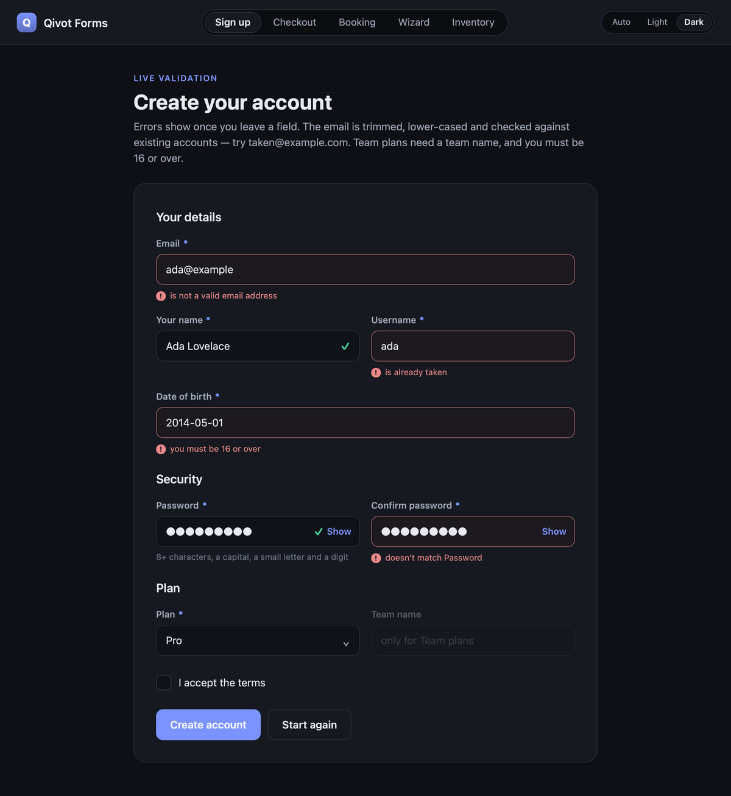
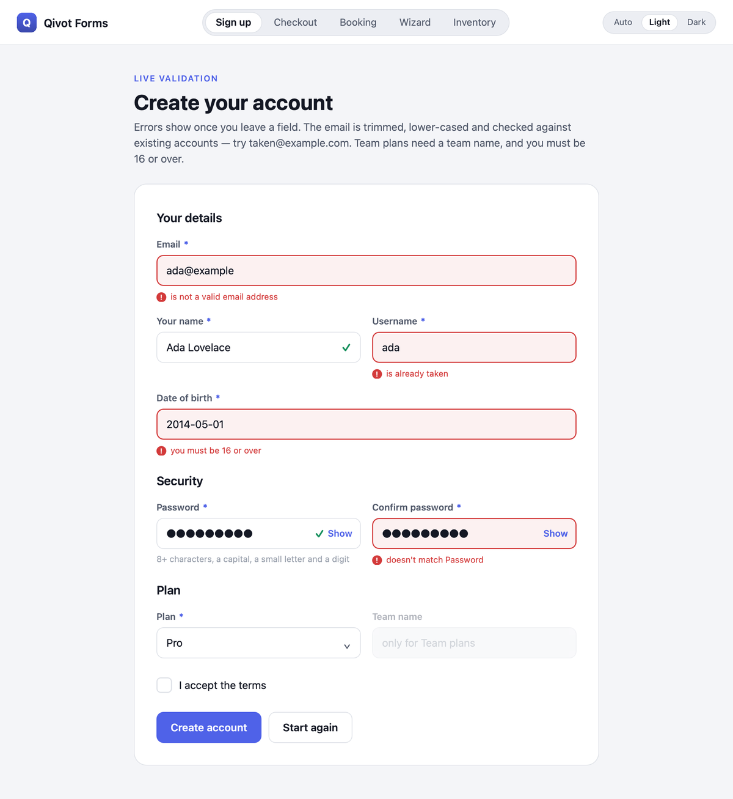
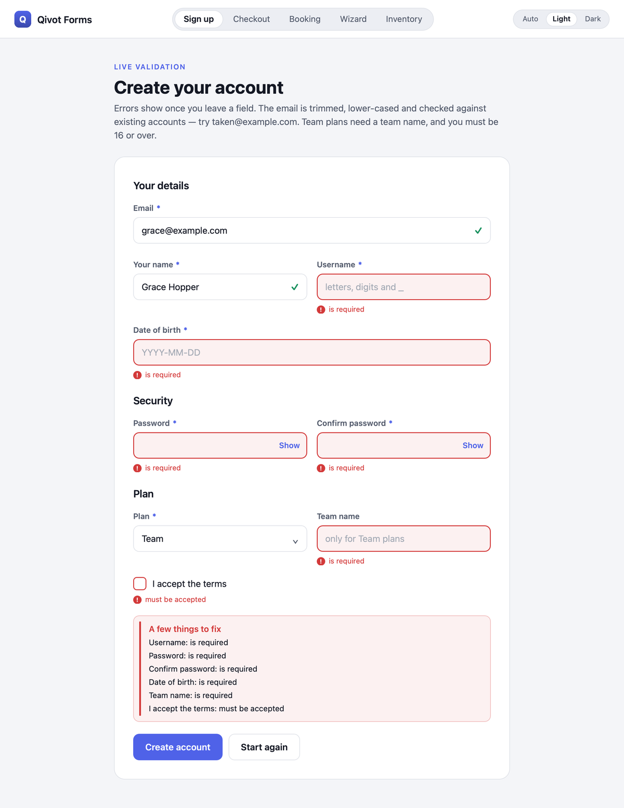
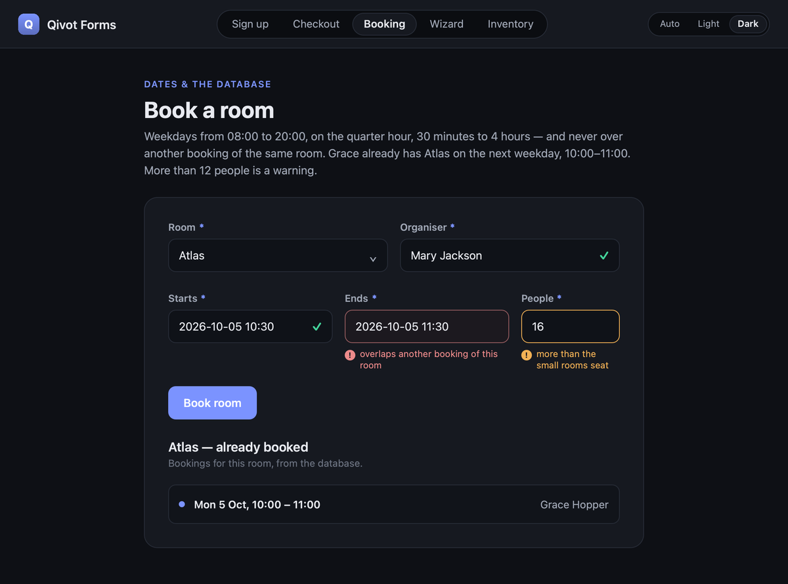
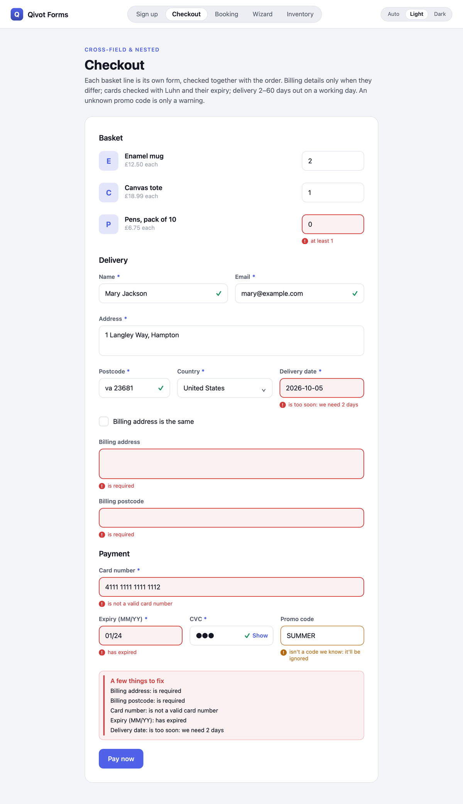
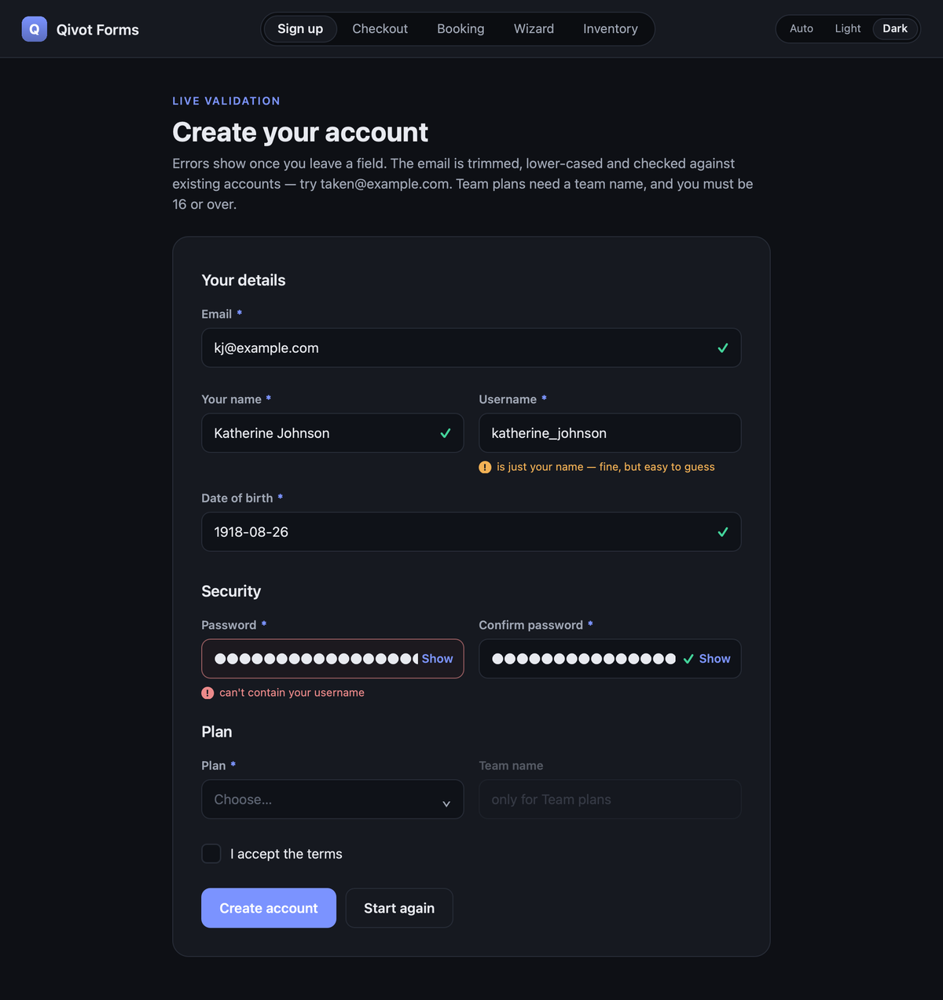
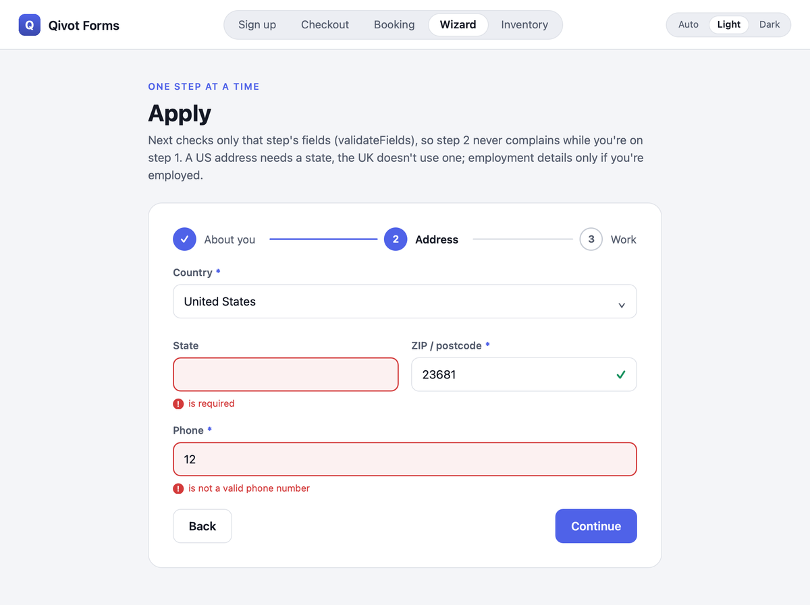
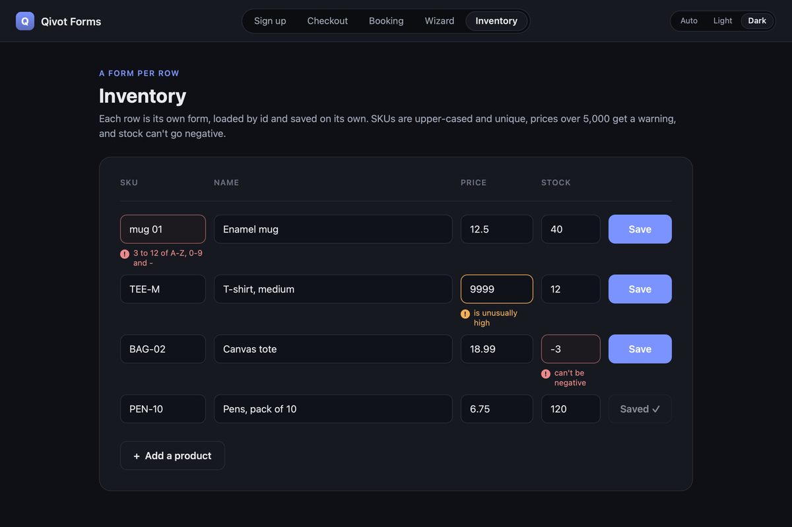

# Tutorial — forms that validate themselves

Declare the rules once, on the model. Every form, every `save()` and the database
then agree on them, and QML shows them live with one line per field.

<p align="center">
  
  
</p>

This example is five pages — a sign-up, a checkout, room booking, a three-step
wizard and an editable inventory table — and this tutorial builds up every
feature they use, from the first rule to your own validators in QML.

> **Run it**
> ```sh
> cd examples/forms
> qmake && make          # Qt 5.15 or 6
> ./forms
> ```
> `QIVOT_SELFTEST=1 QT_QPA_PLATFORM=offscreen ./forms` drives every page headlessly
> and fails on a wrong answer or a QML warning.

**Contents**

1. [Rules on the model](#1-rules-on-the-model)
2. [Wiring it up](#2-wiring-it-up)
3. [A form in QML](#3-a-form-in-qml)
4. [When errors show](#4-when-errors-show)
5. [Clean-up before checking](#5-clean-up-before-checking)
6. [Asking the database](#6-asking-the-database)
7. [Fields that depend on each other](#7-fields-that-depend-on-each-other)
8. [Dates and times](#8-dates-and-times)
9. [Warnings](#9-warnings)
10. [Your own validators](#10-your-own-validators)
11. [A wizard: one step at a time](#11-a-wizard-one-step-at-a-time)
12. [Lists: a form per row](#12-lists-a-form-per-row)
13. [Any control, and controls of your own](#13-any-control-and-controls-of-your-own)
14. [Theming](#14-theming)
15. [Messages, labels and translation](#15-messages-labels-and-translation)
16. [Reference](#16-reference)

---

## 1. Rules on the model

Rules go in `QI_DECLARE_MODEL`, next to the field options Qivot already had
(`QiNotNull`, `QiUnique`, …), combined with `|`. From [`models.h`](models.h):

```c++
#include <qivot.h>

class Member : public QiModel {
    QI_MODEL
public:
    QiField<QString> email;
    QiField<QString> name;
    QiField<QString> username;
    QiField<QString> password;
    QiField<QString> password_confirm;
    QiField<QDate>   born;
    QiField<QString> plan;
    QiField<QString> team_name;
    QiField<bool>    terms;
};
QI_DECLARE_MODEL(Member, "member",
    QI_FIELD(email,    QiNotNull | QiUnique | QiTrim() | QiLower() | QiEmail()),
    QI_FIELD(name,     QiLabel("Your name") | QiRequired() | QiCollapseSpaces() | QiLength(2, 60)),
    QI_FIELD(username, QiRequired() | QiLower() | QiPattern("^[a-z0-9_]{3,20}$", "3 to 20 of a-z, 0-9 and _")
                       | QiUniqueIn() | QiNotOneOf({ "admin", "root", "support" }).message("is reserved")),
    QI_FIELD(password, QiRequired() | QiStrongPassword(8)),
    QI_FIELD(password_confirm, QiLabel("Confirm password") | QiRequired() | QiSameAs("password")),
    QI_FIELD(born,     QiLabel("Date of birth") | QiRequired() | QiPast()
                       | QiMinAge(16).message("you must be 16 or over")
                       | QiMaxAge(120).warning().message("is that right?")),
    QI_FIELD(plan,     QiRequired() | QiOneOf({ "Free", "Pro", "Team" })),
    QI_FIELD(team_name, QiRequiredIf("plan", "Team") | QiLength(0, 40)),
    QI_FIELD(terms,    QiLabel("I accept the terms")
                       | QiCustom("accepted", "must be accepted", [](const QVariant &v) { return v.toBool(); })
                             .checkingNull()));
```

That's all the validation the sign-up page has. The same rules run in C++
without any UI:

```c++
Member m;
m.email = "ada@example";
QiValidation v = m.validate();
v.isValid();            // false
v.error("email");       // "is not a valid email address"
v.summary();            // "Email: is not a valid email address\nYour name: is required\n…"
v.toJson();             // { "valid": false, "errors": { "email": [ … ] }, "warnings": { } }

if (!m.save())          // save() validates first
    qWarning() << m.lastError().text();
```

A rule that isn't about emptiness doesn't fire on an empty value: `QiEmail()` on
an optional field accepts an empty string. `QiRequired()` (or `QiNotNull`) is what
makes a field mandatory.

## 2. Wiring it up

Include `qivot-qml.pri` instead of `qivot.pri` — it adds `QiForm` and the
`Qivot.Forms` controls (and needs Qt Quick). From [`forms.pro`](forms.pro):

```pro
QT += core sql qml quick quickcontrols2
include(../../src/qivot-qml.pri)
```

With CMake, configure Qivot with `-DQIVOT_WITH_QML=ON` and link `Qivot::qml`.

Then, in [`main.cpp`](main.cpp), open the database, register the models, and
register QML before loading it:

```c++
QiConnection connection;
connection.open(db);
connection.addModel<Member>();     // a form can only use a registered model
connection.createTables();

QQmlApplicationEngine engine;
qiRegisterQml(&engine);            // QiForm (import Qivot 1.0) + the controls (import Qivot.Forms 1.0)
engine.load(QUrl("qrc:/Main.qml"));
```

The controls draw themselves, so use Qt Quick Controls' plain style:
`QQuickStyle::setStyle("Basic")` (`"Default"` on Qt 5).

## 3. A form in QML

A `QiForm` holds one record of a model. The controls take the form and a field
name; everything else — label, required marker, value, errors — comes from the
model. From [`SignUpPage.qml`](SignUpPage.qml):

```qml
import Qivot 1.0
import Qivot.Forms 1.0

QiForm {
    id: signup
    model: "Member"
    onSaved: function(savedId) { done.text = "Welcome aboard, " + signup.values.name }
}

QiTextField     { form: signup; field: "email"; placeholderText: "you@example.com" }
QiTextField     { form: signup; field: "name" }
QiDateField     { form: signup; field: "born" }
QiPasswordField { form: signup; field: "password"; hint: "8+ characters, a capital, a small letter and a digit" }
QiPasswordField { form: signup; field: "password_confirm" }
QiComboBox      { form: signup; field: "plan" }        // its entries are the QiOneOf values
QiCheckBox      { form: signup; field: "terms" }

QiErrorSummary  { form: signup }
QiSubmitButton  { form: signup; text: "Create account" }
```

`submit()` validates everything, saves if it can, and emits `saved(id)` or
`failed(summary)`. To edit an existing record instead, `signup.load(id)`;
`reset()` starts a new one.

## 4. When errors show

A form that's red before anyone has typed is hostile, so errors show for fields
that have been **visited** (left once) — or everywhere after a **submit**:

| When | What runs |
|---|---|
| Every keystroke | the quick rules (format, length, …) |
| Leaving a field | its database rules too (taken emails, overlaps, …) |
| `submit()` / `validate()` | everything, including `clean()` |

A visited field that's fine gets a ✓. After a submit, `QiErrorSummary` lists
every problem:

<p align="center"></p>

What the form knows is all bindable, so you can build any UI on it:

```qml
Label  { text: signup.errors.email || "" }              // what to show for a field ("" until visited)
Label  { text: signup.allErrors.email || "" }           // every error, visited or not
Button { enabled: signup.valid && signup.dirty }         // nothing wrong, and something changed
Label  { visible: !!signup.visited.email; text: "✓" }
```

Text that isn't the field's type never reaches the record: `"abc"` in a number
field is *must be a whole number*, `"2026-02-30"` in a date field is *is not a
valid date*.

## 5. Clean-up before checking

`QiTrim()`, `QiLower()`, `QiUpper()`, `QiCollapseSpaces()` and `QiNormalize(fn)`
change the value before the other rules see it — so `"  Ada@Example.COM "` is
checked (and saved) as `ada@example.com`, and `"  Ada    Lovelace "` as
`Ada Lovelace`. The field keeps showing what was typed until the record is saved.

```c++
QI_FIELD(email, QiTrim() | QiLower() | QiEmail())
QI_FIELD(sku,   QiTrim() | QiUpper() | QiPattern("^[A-Z0-9-]{3,12}$"))
QI_FIELD(phone, QiNormalize([](const QVariant &v) { return QVariant(v.toString().remove(' ')); }) | QiPhone())
```

## 6. Asking the database

Some rules need the database, and run when a field is left (and on submit):

```c++
QI_FIELD(email,    QiUnique)                                 // the column's own UNIQUE: "is already taken"
QI_FIELD(sku,      QiUniqueIn({ "store_id" }))               // unique within each store
QI_FIELD(room,     QiExists("room", "name"))                 // must be a room that exists
QI_FIELD(ends_at,  QiNoOverlap("starts_at", { "room" }))     // no other booking of this room overlaps
```

Editing a record never clashes with itself. On the booking page, Grace already
has Atlas from 10:00 to 11:00, so 10:30–11:30 is refused — while 11:00–12:00,
which only touches it, is fine:

<p align="center"></p>

From [`models.h`](models.h):

```c++
QI_DECLARE_MODEL(Booking, "booking",
    QI_FIELD(room,      QiRequired() | QiExists("room", "name")),
    QI_FIELD(organiser, QiRequired() | QiCollapseSpaces() | QiLength(2, 60)),
    QI_FIELD(starts_at, QiLabel("Starts") | QiRequired() | QiFuture() | QiWeekday()
                        | QiTimeBetween(QTime(8, 0), QTime(19, 30)).message("we're open 08:00 to 20:00")
                        | QiTimeStep(15).message("must be on the quarter hour")),
    QI_FIELD(ends_at,   QiLabel("Ends") | QiRequired() | QiAfter("starts_at")
                        | QiMinutesAfter("starts_at", 30, 240).message("a booking is 30 minutes to 4 hours")
                        | QiNoOverlap("starts_at", { "room" }).message("overlaps another booking of this room")),
    QI_FIELD(people,    QiRequired() | QiRange(1, 40) | QiMax(12).warning().message("more than the small rooms seat")));
```

When the database itself refuses a write — two people saving the same email at
once — its error comes back on the field: *duplicate key … Key (email)* becomes
*email: is already taken*, on every backend. Forms also call `validate()` first,
which catches the duplicate before anything is written.

## 7. Fields that depend on each other

The checkout asks for a billing address only when it differs from the delivery
one, refuses a mistyped card number (Luhn) or an expired card, and wants a
delivery date at least two days out, on a working day:

<p align="center"></p>

```c++
QI_FIELD(billing_same, QiLabel("Billing address is the same")),
QI_FIELD(bill_address, QiRequiredIf("billing_same", false) | QiProhibitedIf("billing_same", true)),
QI_FIELD(card_number,  QiRequired() | QiLuhn()),
QI_FIELD(card_expiry,  QiRequired() | QiNotExpired()),               // MM/YY, valid through the month
QI_FIELD(cvc,          QiRequired() | QiPattern("^[0-9]{3,4}$", "is 3 or 4 digits")),
QI_FIELD(deliver_on,   QiRequired() | QiDateMin("today+2d").message("is too soon: we need 2 days")
                       | QiDateMax("today+60d") | QiBusinessDay(isHoliday)),
```

The tools for this:

| | |
|---|---|
| `QiRequiredIf(field, value)` / `QiRequiredIf(condition)` | required when another field has a value (or any condition) |
| `QiRequiredUnless(field, value)` | required unless … |
| `QiProhibitedIf(field, value)` | must be empty when … |
| `QiSameAs(field)` / `QiDifferentFrom(field)` | confirmations |
| `QiGreaterThan(field)` / `QiLessThan(field)` | numbers, text or dates |
| `.when(condition)` | any rule, only sometimes |
| `clean()` + `addError(field, message)` | anything else, across the whole record |

In the page, a hidden section is just `visible: !checkout.values.billing_same` —
the rules already know when the fields matter.

## 8. Dates and times

Dates take `QDate`, `QDateTime`, `QTime` or ISO text (`2026-10-03`,
`2026-10-03 14:30`). A string that isn't a real date, like `2026-02-30`, is
*is not a valid date*. Limits can be fixed or relative to now:

```c++
QiDateMin("today+2d")      QiDateMax("today+60d")      QiDateBetween("2026-01-01", "today")
QiPast()   QiFuture()   QiTodayOrLater()   QiTodayOrEarlier()
QiMinAge(18)               QiMaxAge(120)               // birth dates
QiWeekday()  QiWeekend()   QiOnDays({ Qt::Saturday })  QiNotOn(holidays)   QiBusinessDay(isHoliday)
QiTimeBetween(QTime(8, 0), QTime(20, 0))               // opening hours (22:00–06:00 spans midnight)
QiTimeStep(15)                                         // quarter-hour slots
QiAfter("starts_at")       QiBefore("deadline", true)  // true: or equal
QiDaysAfter("check_in", 1, 30)                         // 1 to 30 nights
QiMinutesAfter("starts_at", 30, 240)                   // 30 minutes to 4 hours
QiNotExpired()                                         // MM/YY or MM/YYYY
QiExistingLocalTime("Europe/Berlin")                   // not 02:30 on the night the clocks spring forward
```

Relative limits: `now`, `today`, `tomorrow`, `yesterday`, then `+`/`-` amounts in
`s`, `min`, `h`, `d`, `w`, `m` (months) or `y` — `"today+1m-1d"`, `"-18y"`.
`.inZone("Europe/Paris")` makes "today" and times of day mean Paris's.

## 9. Warnings

Any rule can be a warning instead: it's shown (in amber, as on the booking page
above), but it doesn't stop a save.

```c++
QI_FIELD(price,  QiPositive() | QiMax(5000).warning().message("is unusually high")),
QI_FIELD(promo,  QiOneOf({ "WELCOME10", "SPRING" }).warning().message("isn't a code we know: it'll be ignored")),
```

`form.warnings`, `QiValidation::warning(field)` and `warnings()` read them.

## 10. Your own validators

Four ways, depending on where the rule lives:

**One field, in C++** — a rule like any other, with every modifier:

```c++
QI_FIELD(terms, QiCustom("accepted", "must be accepted", [](const QVariant &v) { return v.toBool(); }).checkingNull())
QI_FIELD(code,  QiCustom("checksum", "has a typo in it", &isValidCode).on("create"))
```

**The whole record, in C++** — a rule that reads other fields:

```c++
QI_FIELD(discount, QiCustom("discount", "can't be more than the price",
                            [](const QiRuleContext &c) { return c.value().toDouble() <= c.valueOf("price").toDouble(); }))
```

or `clean()`, for anything:

```c++
bool Event::clean() {
    if (ends.get().toDate() < starts.get().toDate())
        addError("ends", "can't be before the start");       // or addWarning(…)
    return true;                                              // false still stops the save
}
```

**In QML** — next to the page, as JavaScript. A function gets the field's value
and every value, and returns `""` when it's fine, a message when it isn't, or
`{ message, warning: true }`:

```qml
QiForm {
    model: "Member"
    validators: ({
        username: function(value, values) {
            if (value && values.name && value.toLowerCase() === values.name.toLowerCase().replace(/ /g, "_"))
                return { message: "is just your name — fine, but easy to guess", warning: true }
            return ""
        },
        password: function(value, values) {
            return value && values.username && value.toLowerCase().indexOf(values.username.toLowerCase()) >= 0
                   ? "can't contain your username" : ""
        }
    })
}
```

<p align="center"></p>

**From somewhere else** — a server's answer, say: `form.setError("email", "is blocked")`.
It shows like any error and clears when the field changes.

## 11. A wizard: one step at a time

`validateFields([...])` checks only the fields you name (with their database
rules), so step 2 never complains while you're on step 1. From
[`WizardPage.qml`](WizardPage.qml):

```qml
readonly property var steps: [
    [ "first_name", "last_name", "email", "born" ],
    [ "country", "state", "postcode", "phone" ],
    [ "employed", "employer", "started", "income" ]
]

QiButton {
    text: page.step < 2 ? "Continue" : "Send application"
    onClicked: {
        if (!wizard.validateFields(page.steps[page.step]))
            return
        if (page.step < 2) page.step++
        else wizard.submit()
    }
}
```

<p align="center"></p>

Rules can also be limited to a context — `QiRequired().on("step2")` runs only for
`form.validate("step2")` — and `form.context = "upgrade"` sets one for the whole
form.

## 12. Lists: a form per row

Each row of the inventory is its own `QiForm`, loaded by id, with its errors
under each cell and its own Save:

<p align="center"></p>

```qml
ListView {
    model: demo.products()                // the ids
    delegate: RowLayout {
        QiForm { id: product; model: "Product"; Component.onCompleted: load(modelData) }
        QiTextField   { form: product; field: "sku";   label: "" }
        QiTextField   { form: product; field: "name";  label: "" }
        QiNumberField { form: product; field: "price"; label: "" }
        QiButton { text: product.dirty ? "Save" : "Saved ✓"; enabled: product.dirty; onClicked: product.submit() }
    }
}
```

The checkout's basket works the same way, and *Pay now* checks the lines and
the order together. In C++, a list is checked in one go, its errors at paths:

```c++
QiValidation all = order.validate();
all.merge(qiValidateAll(order.lines, "lines"));         // "lines[2] Quantity: at least 1"
```

## 13. Any control, and controls of your own

Any control can be bound to a field with the attached properties — it picks the
property to bind (`text`, `checked`, `currentText` or `value`) and binds it both
ways:

```qml
TextField {
    id: username
    QiForm.form: signup
    QiForm.field: "username"
}
Label { text: username.QiForm.error }        // also .warning, .label, .required, .hasError
```

To give your own control the same label and messages, put it in a `QiFormRow`,
and give it the same box with `QiFieldBackground`:

```qml
QiFormRow {
    form: signup
    field: "username"
    TextField {
        id: input
        Layout.fillWidth: true
        QiForm.form: signup
        QiForm.field: "username"
        background: QiFieldBackground { focused: input.activeFocus; hovered: input.hovered; hasError: input.QiForm.hasError }
    }
}
```

## 14. Theming

The controls follow the system's light or dark mode. Every colour and size is
in the `QiTheme` singleton:

```qml
import Qivot.Forms 1.0

QiTheme.mode = QiTheme.Dark          // QiTheme.Light, QiTheme.Auto (the default)
QiTheme.accent = "#0a84ff"           // buttons, focus, the required marker
QiTheme.radius = 6
QiTheme.fieldHeight = 40
```

`QiButton` (primary, or `primary: false`) matches the fields. The pictures in
this tutorial are the same pages in both modes.

## 15. Messages, labels and translation

- `QiLabel("Date of birth")` names a field in messages, the summary and the form's
  labels; without it, `first_name` reads as *First name* and `author_id` as *Author*.
- `.message("…")` replaces a rule's text. Messages can use placeholders from the
  rule: `{min}`, `{max}`, `{otherLabel}`, `{value}`, `{label}`, …

  ```c++
  QiLength(2, 40).message("between {min} and {max} letters, please")
  QiSameAs("password").message("must match {otherLabel}")
  ```
- Every message goes through `QCoreApplication::translate("QiValidation", …)`, so a
  translation file with that context translates them all.

## 16. Reference

**QiForm** (`import Qivot 1.0`)

| Property | |
|---|---|
| `model` | the model's class name (`"Member"`) or table (`"member"`) |
| `context` | `"create"` / `"update"` by default, or your own |
| `validators` | `{ field: function(value, values) { … } }` |
| `values` | field → value, as the controls show it |
| `errors` / `allErrors` / `warnings` | field → first message (shown fields / all fields / warnings) |
| `visited` | field → true once left (or after a submit) |
| `valid`, `dirty`, `submitted` | no errors · changed since load/reset · submit tried |
| `labels`, `required`, `choices`, `maxLengths` | from the model: for labels, `*`, combo boxes, `maximumLength` |
| `summary`, `error` | "Label: message" lines · a failed save's reason |
| `recordId`, `isNew` | the record |

| Method / signal | |
|---|---|
| `set(field, value)`, `value(field)` | from a control (and check it) |
| `touch(field)` | the field was left: show its errors, ask the database |
| `validate(context)`, `validateFields([…])` | check everything / some fields |
| `submit()` → `saved(id)` / `failed(summary)` | validate, then save |
| `load(id)`, `reset()` | edit a record / a new one |
| `setError(field, message)` | an error of your own |

**Controls** (`import Qivot.Forms 1.0`) — each takes `form` and `field`, and has
`label`, `hint`, `showValid`, `error`, `warning`, `required`, `isValid`.

| | |
|---|---|
| `QiTextField` | `placeholderText`, `echoMode`, `inputMethodHints`, `readOnly`, `input` |
| `QiPasswordField` | a Show/Hide toggle |
| `QiTextArea` | `rows` |
| `QiNumberField`, `QiDateField`, `QiDateTimeField` | typed text: numbers, `YYYY-MM-DD`, `YYYY-MM-DD HH:MM` |
| `QiCheckBox` | `text` |
| `QiComboBox` | `choices` (default: the field's `QiOneOf`), `placeholder` |
| `QiFormRow` | label + any control + messages |
| `QiFieldBackground` | the field box, for your own controls |
| `QiButton`, `QiSubmitButton` | `primary`, `busy` |
| `QiErrorSummary` | `title` |
| `QiTheme` | colours, sizes, `mode` |

Every rule is listed in Qivot's README, under
[Validation](../../README.md#validation).

## Files

| File | |
|---|---|
| [`models.h`](models.h) | The records and every rule. |
| [`main.cpp`](main.cpp) | Opens a fresh SQLite file, seeds it, registers QML; the self-test and the screenshots. |
| [`SignUpPage.qml`](SignUpPage.qml) | Live validation, a taken email, QML validators, the attached properties. |
| [`CheckoutPage.qml`](CheckoutPage.qml) | Conditional fields, cards, delivery dates, basket lines checked together. |
| [`BookingPage.qml`](BookingPage.qml) | Dates, opening hours, overlapping bookings, a warning. |
| [`WizardPage.qml`](WizardPage.qml) | Three steps with `validateFields`. |
| [`InventoryPage.qml`](InventoryPage.qml) | A form per row. |
| `DemoPage.qml`, `Section.qml`, `Banner.qml`, `Segmented.qml` | The demo's own layout pieces. |

The pictures are made by the app itself:
`QIVOT_SHOTS=/tmp/shots QT_QPA_PLATFORM=offscreen QT_SCALE_FACTOR=2 ./forms`, then
`python3 ../../tools/crop-screenshots.py /tmp/shots screenshots`.
