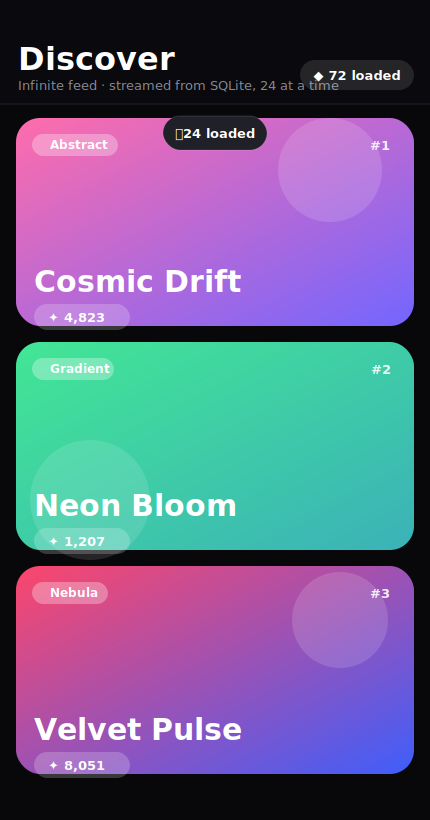

# Tutorial — a DB-backed infinite-scroll feed

Build a gradient "discovery" feed that streams rows from SQLite **a page at a
time** as the user scrolls — never loading the whole table. This is the
*append-on-scroll* paging strategy, powered by **`QiLazyListModel`**.



*(mockup — run it for the animations, entrance transitions, and live footer)*

By the end you'll understand:

- how `QiLazyListModel` pages a query with `LIMIT`/`OFFSET`,
- how a QML `ListView` pulls the next page automatically via `fetchMore()`,
- and how to surface the fetching to the user (a live footer + "＋N loaded" toast).

> **Run it first**
> ```sh
> cd examples/infinitescroll
> qmake && make
> ./infinitescroll
> ```
> Scroll and watch the footer name the exact rows it's fetching.

---

## Step 1 — Define the model

Each card is a row. All of its content — the gradient colors, title, category,
and metric — is real, DB-backed data, not faked in QML.

```cpp
// item.h
class Item : public QiModel {
    QI_MODEL
public:
    QiField<QString> title;
    QiField<QString> subtitle;   // category
    QiField<QString> colorA;     // gradient start (hex)
    QiField<QString> colorB;     // gradient end   (hex)
    QiField<int>     metric;
};
QI_DECLARE_MODEL(Item, "item",
    QI_FIELD(title), QI_FIELD(subtitle),
    QI_FIELD(colorA), QI_FIELD(colorB), QI_FIELD(metric));
```

## Step 2 — Seed the table

Generate 5,000 vibrant, deterministic rows and insert them in one batched
`QiListWriter` transaction.

```cpp
// main.cpp (abridged) — 16 palettes, adjective+noun titles
for (int i = 0; i < 5000; i++) {
    auto g = grads.at((i * 7) % grads.size());
    writer << (adjs.at(i % adjs.size()) + " " + nouns.at((i / adjs.size()) % nouns.size()))
           << cats.at((i * 3) % cats.size())
           << g.first << g.second
           << int((quint32(i) * 2654435761u) % 9900u) + 100
           << writer.next();
}
seed.save();
```

## Step 3 — Page the query with `QiLazyListModel`

The controller wraps a `QiLazyListModel`, points it at an ordered query, and
picks a page size. `reset()` loads the first page; the view pulls the rest.

```cpp
// itemstore.cpp
ItemStore::ItemStore(QObject *parent) : QObject(parent) {
    m_model.setQuery( Item::objects().orderBy(Item::col().id.asc()), 24 ); // 24/page
    m_model.reset();   // loads page 1 only
}
```

```cpp
// itemstore.h — expose it (and the page size) to QML
class ItemStore : public QObject {
    Q_OBJECT
    QML_ELEMENT
    Q_PROPERTY(QAbstractItemModel *items READ items CONSTANT)
    Q_PROPERTY(int pageSize READ pageSize CONSTANT)
    // ...
    QiLazyListModel m_model;
};
```

Under the hood `setQuery` builds a fetcher that runs
`query.limit(pageSize).offset(loadedSoFar).all()` each time more rows are needed.
Use a **stable `orderBy`** so paging is consistent.

## Step 4 — Let the `ListView` pull pages

`QiLazyListModel` implements `canFetchMore()` / `fetchMore()`, which Qt's item
views call automatically as the user nears the end. So the QML is just a normal
`ListView` bound to the model — no scroll math required.

```qml
ItemStore { id: store }

ListView {
    id: list
    model: store.items
    delegate: Item {
        // roles come straight from the model's fields:
        Rectangle {
            gradient: Gradient {          // colorA -> colorB, both from the DB
                GradientStop { position: 0; color: colorA }
                GradientStop { position: 1; color: colorB }
            }
            Text { text: title }
            Text { text: "#" + (index + 1) }
        }
    }
}
```

## Step 5 — Show the fetching

The model exposes two QML-friendly properties:

- **`count`** — how many rows have streamed in so far.
- **`atEnd`** — `true` once a short/empty page proves there's no more.

Use them in the `footer` to narrate the paging — including the exact rows being
fetched next:

```qml
footer: Item {
    // while more remains: a spinner + the literal LIMIT/OFFSET window
    Text {
        visible: !store.items.atEnd
        text: "Fetching rows " + (store.items.count + 1) + "–" +
              (store.items.count + store.pageSize) + " from SQLite…"
    }
    // when done:
    Text { visible: store.items.atEnd; text: "✓ You've reached the end" }
}
```

And flash a toast whenever a new page arrives, by watching `count`:

```qml
Connections {
    target: store.items
    function onCountChanged() {
        var delta = store.items.count - win.lastCount;
        win.lastCount = store.items.count;
        if (win.primed && delta > 0) toast.flash(delta);   // "＋24 loaded"
        win.primed = true;
    }
}
```

---

## Lazy vs. windowed

`QiLazyListModel` **appends** pages and grows — `count` climbs as you scroll and
`rowCount` only reaches the total once you've reached the end. That's exactly
right for an endless feed where the total doesn't matter.

When you *do* need the total up front — for an accurate scrollbar, sticky
section indices, or jump-to-row — reach for **`QiWindowedListModel`** instead
(it counts once, then fetches pages on demand and evicts old ones). See the
[`contacts`](../contacts) tutorial for that approach.

## Files

| File | Role |
|---|---|
| `item.h` | The `Item` model — title, category, two gradient colors, a metric. |
| `itemstore.h` / `.cpp` | QML controller: wraps `QiLazyListModel`, sets the query + page size. |
| `main.cpp` | Opens the DB, seeds 5,000 rows, loads the QML. |
| `main.qml` | The gradient feed: animated cards, live "fetching" footer, "＋N" toast. |

## Environment variables

- `QIVOT_SELFTEST=1` — load a few pages then quit, for headless checks
  (`QT_QPA_PLATFORM=offscreen ./infinitescroll`).
