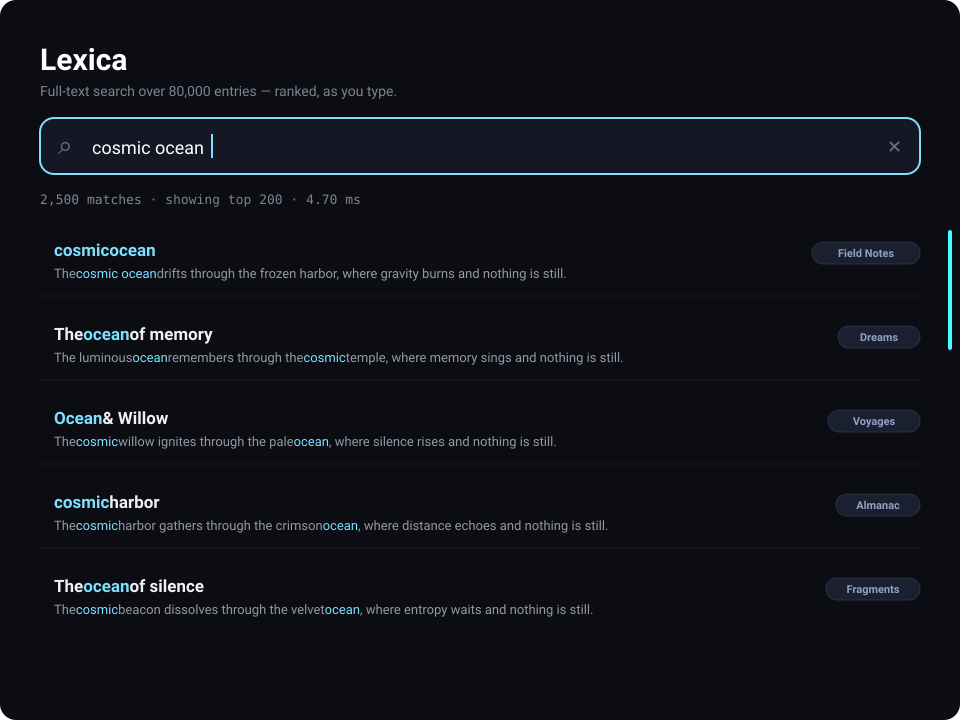

# Tutorial — Lexica: instant full-text search (explained simply)

Ever wondered how a search box finds a word among *tens of thousands* of entries
in a couple of milliseconds? This example shows exactly that, and it's simpler
than you'd think. No prior SQL or search experience needed.



*(stylized mockup — run it to search live)*

**The idea in one line:** we store 80,000 short text entries in a database, build a
**full-text index** over them, and then search *as you type* — with the best
matches shown first.

> **What's a "full-text index"?** It's like the index at the back of a book: a
> pre-built list of every word and which entries contain it. Instead of reading all
> 80,000 rows every time you type, the database jumps straight to the matching ones.
> That's why it's instant. SQLite's version is called **FTS5**.

> **Run it**
> ```sh
> cd examples/lexica
> qmake && make
> ./lexica
> ```

This is the **read** companion to [`fluxo`](../fluxo) (the *write* showcase): one
writes millions of rows fast, the other searches tens of thousands instantly.

---

## Step 1 — Describe one entry

Each entry is a `title`, a `body` (a sentence), and a `category`. These are the
things we'll search:

```cpp
// doc.h
class Doc : public QiModel {
    QI_MODEL
public:
    QiField<QString> title;
    QiField<QString> body;
    QiField<QString> category;
};
QI_DECLARE_MODEL(Doc, "doc",
    QI_FIELD(title), QI_FIELD(body), QI_FIELD(category));
```

## Step 2 — Fill the database

On startup the app generates 80,000 entries and saves them **in one batch** (fast):

```cpp
// main.cpp
QiList<Doc> seed;
QiListWriter w(&seed);
for (int i = 0; i < 80000; i++)
    w << title << body << category << w.next();
seed.save();          // one efficient bulk insert
```

## Step 3 — Build the search index (the key step)

This one call builds the full-text index over the `title` and `body` columns:

```cpp
QiFtsIndex<Doc> fts("doc_fts");   // name of the index
fts << "title" << "body";         // which columns are searchable
connection.createFtsIndex(fts);   // builds the index over everything already there
```

Two things happen automatically:

1. It **reads all 80,000 rows once** and builds the word index (took ~145 ms here).
2. It installs **triggers** so the index stays correct forever after. From now on,
   any `save()`, `upsert()`, or `remove()` updates the search index by itself — you
   never touch it again.

## Step 4 — Search, ranked by relevance

Searching is a single call. `search()` finds every entry that matches and returns
the **best matches first** (that's what "ranked" means — SQLite scores how well
each row matches):

```cpp
// searchstore.cpp
QiList<Doc> hits = QiQuery<Doc>().search("doc_fts", "cosmic ocean").limit(200).all();
```

That's the whole search. Over 80,000 entries it comes back in a **few
milliseconds**.

## Step 5 — Make it search *as you type*

Two small touches turn that into a live search box:

**1. Prefix matching.** So "oce" already finds "ocean", we add a `*` to each word
the user types:

```cpp
// "cosmic oce"  ->  "cosmic* oce*"   (an FTS5 prefix query)
```

**2. Debouncing.** We wait ~110 ms after the last keystroke before searching, so we
don't run a query on every single letter:

```qml
TextField { id: search; onTextChanged: debounce.restart() }
Timer { id: debounce; interval: 110; onTriggered: store.search(search.text) }
```

The matched words are then highlighted in the results (done in QML, in
`highlight()` in `main.qml`).

---

## Try this in the app

1. **Type slowly** — `c` … `co` … `cos` … `cosm`. Results narrow with each letter,
   and the "N matches · X ms" line updates. Watch how it stays in the low
   milliseconds even with thousands of hits.
2. **Type two words** — `silent forest`. FTS5 treats a space as "must contain
   both," so results shrink. (This is a genuine AND search.)
3. **Click an example chip** under the box to drop in a query.
4. **Notice the ranking** — entries where your words appear in the *title* tend to
   float to the top, because a title match scores higher than a body match.

## The line under the search box, explained

```
2,500 matches  ·  showing top 200  ·  4.36 ms
```

- **matches** — how many entries in the whole corpus matched (Step 4).
- **showing top 200** — we only *display* the 200 best; there's no point drawing
  thousands of rows.
- **ms** — how long the search took. That's real: searching 80,000 entries.

## Files

| File | Role |
|---|---|
| `doc.h` | The entry: `title`, `body`, `category` (Step 1). |
| `main.cpp` | Generates the corpus, saves it, builds the FTS index (Steps 2–3). |
| `searchstore.h` / `.cpp` | Turns your text into a prefix query and runs `search()` (Steps 4–5). |
| `main.qml` | The search box, the live stats, and the highlighted result list. |

## See also

- [`fluxo`](../fluxo) — the write side: saving millions of rows fast.
- [`contacts`](../contacts) — paging through a big table a screen at a time.
- The main guide's [Full-text search (FTS5)](../../README.md#full-text-search-fts5)
  section, in plain prose.
