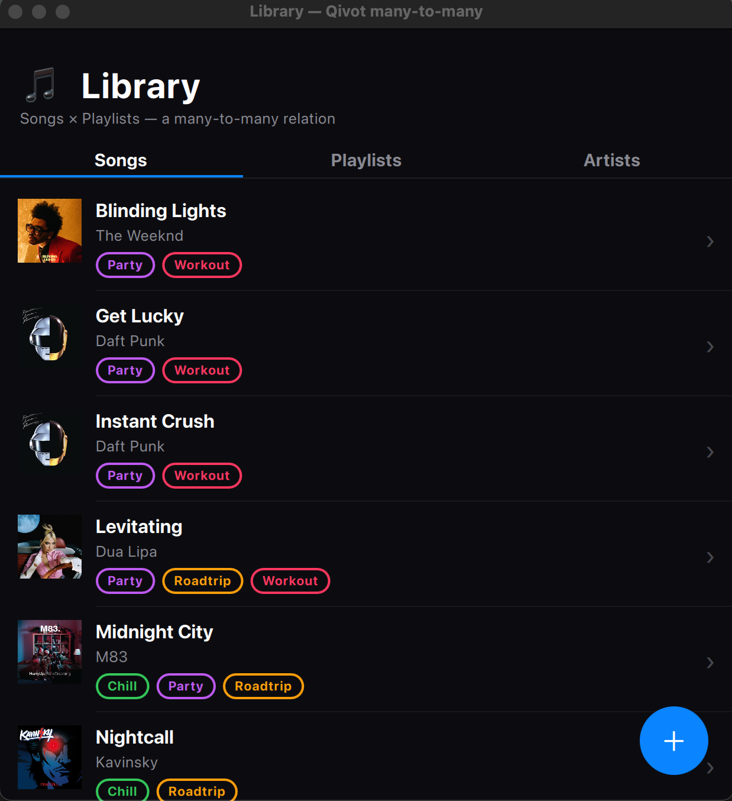

# Tutorial — relations in a QML app (music library)

A full Qt Quick app built around **both kinds of relation**:

- **one-to-many** — an **Artist** has many **Songs** (a Song has one Artist),
  via a foreign key. Declared with `QI_HAS_MANY`.
- **many-to-many** — a **Song** belongs to many **Playlists** and a **Playlist**
  holds many **Songs**, via an auto-created join table. Declared with
  `QI_MANY_TO_MANY` on both sides.

Browse songs (each showing its artist and playlist chips), tap a song to toggle
its playlists, tap a playlist to toggle its songs, open the **Artists** tab to
see each artist's songs — and add new ones. Everything updates live.



*(the running app — album covers are fetched live from the iTunes Search API)*

> **Run it**
> ```sh
> cd examples/manytomany
> qmake && make
> ./manytomany
> ```

---

## Step 1 — Declare the relations on the models

Three models. `Artist` has a **one-to-many** to `Song` (`QI_HAS_MANY`, the
reverse of Song's foreign key). `Song` and `Playlist` reference each other
**many-to-many** (`QI_MANY_TO_MANY` on both sides). Both accessors are generated
as defaulted templates, so the models can reference each other and stay
forward-declarable.

```cpp
// models.h
class Song; class Playlist;    // forward declarations for the accessors

class Artist : public QiModel {
    QI_MODEL
public:
    QiField<QString> name;
    QI_HAS_MANY(Song, songs, "artist")            // one-to-many: artist.songs()
};
QI_DECLARE_MODEL(Artist, "artist", QI_FIELD(name));

class Song : public QiModel {
    QI_MODEL
public:
    QiField<QString>     title;
    QiForeignKey<Artist> artist;                  // FK -> artist(id)
    QI_MANY_TO_MANY(Playlist, playlists, "song_playlist")   // song.playlists()
};
QI_DECLARE_MODEL(Song, "song", QI_FIELD(title), QI_FIELD(artist));

class Playlist : public QiModel {
    QI_MODEL
public:
    QiField<QString> name;
    QiField<QString> color;
    QI_MANY_TO_MANY(Song, songs, "song_playlist")           // playlist.songs()
};
QI_DECLARE_MODEL(Playlist, "playlist", QI_FIELD(name), QI_FIELD(color));
```

## Step 2 — Use the relations

**Many-to-many** — no join model, no SQL, both directions:

```cpp
song.playlists().add(chill);        // link
song.playlists().remove(chill);     // unlink
song.playlists().contains(chill);   // membership
song.playlists().all();             // QiList<Playlist>
playlist.songs().count();           // reverse direction
```

**One-to-many** — `artist.songs()` returns a composable `QiQuery<Song>`:

```cpp
artist.songs().count();                          // how many songs
artist.songs().orderBy("title asc").all();       // QiList<Song>, chainable
// to link a song to an artist, just set its foreign key:
song.artist = artist.id();  song.save();
```

## Step 3 — A controller for QML

`LibraryStore` (a `QML_ELEMENT`) exposes the two live lists and drives the
relation. Toggling routes through the declarative API; a `revision` counter
bumps on every change so QML membership bindings re-evaluate.

```cpp
void LibraryStore::toggle(int songId, int playlistId) {
    Song s; Playlist pl;
    s.load(Song::col().id == songId);
    pl.load(Playlist::col().id == playlistId);
    if (s.playlists().contains(pl)) s.playlists().remove(pl);
    else                            s.playlists().add(pl);
    bump();                         // -> revisionChanged()
}
```

`playlistChips(songId)` returns `[{id, name, color, member}]` for every playlist
(for the song editor), and `songChips(playlistId)` the mirror image (for the
playlist editor) — each one asks the relation which rows are linked.

## Step 4 — Bind it in QML

The two entity lists are ordinary `QiListModel`s. Membership is recomputed
whenever `store.revision` changes — the classic QML "depend on a counter" idiom:

```qml
// a song row: the playlists it's in, live
property var chips: (store.revision, store.playlistChips(model.id))

Flow {
    Repeater {
        model: chips.filter(function(c){ return c.member })
        Rectangle { /* a colored playlist chip */ }
    }
}
```

The song editor shows **all** playlists as toggle chips; tapping one calls
`store.toggle(songId, playlistId)`, which flips the link and bumps `revision`,
so the chip — and the row behind it, and the playlist's song count — all update
at once. The playlist editor does the same the other way around.

## Album art (fetched at runtime)

Covers are **real album art, looked up live from the public iTunes Search API** —
not bundled files. On startup (and when you add a song) the controller queries
`itunes.apple.com/search`, stores the returned `artworkUrl` on the `Song`, and
the live model refreshes so the QML `Image` loads the cover. A per-song gradient
(the song's initial) shows as the fallback while art loads or when offline:

```cpp
// librarystore.cpp — one QNetworkAccessManager GET per song
QString art = results.at(0).toObject().value("artworkUrl100").toString();
art.replace("100x100bb", "300x300bb");          // crisper
Song s; s.load(Song::col().id == songId);
s.artworkUrl = art; s.save();                    // live model -> Image loads it
```

```qml
Image { source: model.artworkUrl; fillMode: Image.PreserveAspectCrop
        asynchronous: true; visible: status === Image.Ready }
```

No cover files are bundled as app assets — the art is streamed from Apple's CDN
at runtime, the way a real music app does it. Needs `QT += network` and, of
course, an internet connection (offline just shows the gradient fallback).

## What it demonstrates

- **One-to-many** — `Artist --< Song` via a foreign key + `QI_HAS_MANY`; the
  Artists tab shows each artist's song count and songs, and adding a song
  find-or-creates its artist.
- **Declarative, bidirectional many-to-many** — `Song >--< Playlist`, declared
  once per model, join table auto-created (no `PhotoTag`-style model).
- **Real album art** — fetched live from the iTunes Search API, with a graceful
  gradient fallback.
- **Live, two-way editing** — toggle links from the song side or the playlist side.
- **Reactive UI** — one `revision` signal keeps chips, counts, and lists in sync.

---

## Files

| File | Role |
|---|---|
| `models.h` | `Song` and `Playlist`, each with a `QI_MANY_TO_MANY` relation to the other. |
| `librarystore.h` / `.cpp` | QML controller: live lists, `toggle`, chip/count invokables. |
| `main.cpp` | Seeds songs, playlists, and links; loads the QML. |
| `main.qml` | The UI: Songs/Playlists tabs, chip rows, and the two toggle editors. |

## See also

- [`relations`](../relations) — the relation API (plus custom types, hooks,
  timestamps, soft delete) in a console program.
- [`reactive`](../reactive) — the live-model pattern the lists use.
