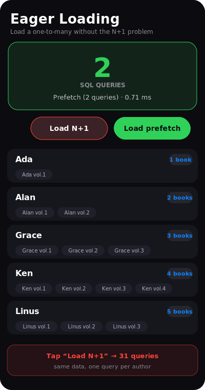

# Tutorial — eager loading (prefetch vs N+1)

Load a one-to-many relation for a whole list without firing one query per parent.
Two buttons load the same **authors + their books** two ways, and a live counter
shows the **real** number of SQL statements each ran.



*(stylized mockup — the card flips to a red “31” on the N+1 path)*

> **Run it**
> ```sh
> cd examples/prefetch
> qmake && make
> ./prefetch
> ```

---

## The N+1 problem

The obvious approach queries the authors, then walks the relation for each one:

```cpp
QiList<Author> authors = Author::objects().all();          // 1 query
for (int i = 0; i < authors.size(); i++) {
    QiList<Book> books = qiHasMany<Book>(*authors.at(i), "author").all();   // +1 each!
    // ...
}
```

With 30 authors that's **31 queries** — it gets slower the more rows you have.

## Prefetch — a fixed two queries

`qiPrefetchHasMany` loads every child in one `IN` query and groups them by parent
key in memory:

```cpp
QiList<Author> authors = Author::objects().all();               // 1 query
QiPrefetch<Book> books  = qiPrefetchHasMany<Book>(authors, "author");  // 1 query

for (int i = 0; i < authors.size(); i++) {
    QList<Book*> theirs = books.forKey(authors.at(i)->id());    // no query — in memory
    // ...
}
```

Always **2 queries**, no matter how many authors. (`qiPrefetchManyToMany` does the
same for join-table relations, in two queries.)

## Counting the difference

The example installs a `QiLog` SQL handler that increments a counter on every
statement, so the count shown is the *actual* SQL executed:

```cpp
QiLog::setEnabled(true);
QiLog::setCategories(QiLog::Sql);
QiLog::setHandler([](QiLog::Level, int cat, const QString &) {
    if (cat & QiLog::Sql) ++sqlCount;
});
```

Press the two buttons and watch the card flip between **31 queries** (red) and
**2 queries** (green) over the same 30 authors.

## Files

| File | Role |
|---|---|
| `models.h` | `Author` and `Book` (a `QiForeignKey<Author>`). |
| `prefetchstore.h` / `.cpp` | Loads both ways; counts SQL via a `QiLog` handler. |
| `main.cpp` | Seeds 30 authors with books, loads the QML. |
| `main.qml` | The query-count card, the two buttons, and the authors list. |

## See also

- [`manytomany`](../manytomany) / [`relations`](../relations) — the relation
  accessors this prefetches.
