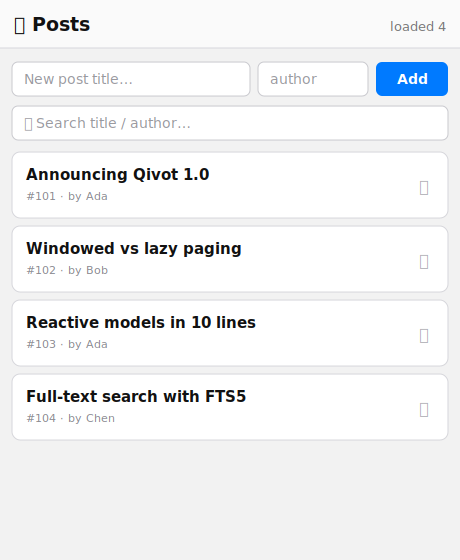

# Tutorial — Qivot × QML (Q_GADGET model + registered controller)

Wire Qivot into a Qt Quick app the modern way: a `Q_GADGET` model whose fields
are `Q_PROPERTY`s, and a **`QML_ELEMENT`-registered controller** that QML
creates declaratively (no `setContextProperty`). You get a `QiListModel` for a
`ListView`, a `NOTIFY`-backed status property, and invokable add / remove /
search slots.



*(mockup — run it for the live behaviour)*

> **Run it**
> ```sh
> cd examples/qmlmodel
> qmake && make
> ./qmlmodel
> ```

---

## Step 1 — A `Q_GADGET` model

`Q_GADGET` (written literally, so qmake's automoc processes the header) makes the
model introspectable; `QI_QML_FIELD` declares each field as both a Qivot field
*and* a `Q_PROPERTY`. Everything else — `save()`, queries — works as usual.

```cpp
// post.h
class Post : public QiModel {
    Q_GADGET
    QI_MODEL
    QI_QML_FIELD(int,     remoteId)
    QI_QML_FIELD(QString, title)
    QI_QML_FIELD(QString, author)
};
QI_DECLARE_MODEL(Post, "post",
                 QI_FIELD(remoteId, QiUnique | QiNotNull),
                 QI_FIELD(title), QI_FIELD(author));
```

## Step 2 — A QML-registered controller

`QML_ELEMENT` registers the type so QML can `import Qivot` and instantiate it.
It exposes a `QiListModel` (`posts`), a bindable `status`, and invokable slots.

```cpp
// poststore.h
class PostStore : public QObject {
    Q_OBJECT
    QML_ELEMENT
    Q_PROPERTY(QAbstractItemModel *posts READ posts CONSTANT)
    Q_PROPERTY(QString status READ status NOTIFY statusChanged)
public:
    Q_INVOKABLE void reload();
    Q_INVOKABLE void add(const QString &title, const QString &author);
    Q_INVOKABLE void remove(int remoteId);
    Q_INVOKABLE void search(const QString &text);   // full-text
signals:
    void statusChanged();
private:
    QiListModel m_model;
};
```

## Step 3 — Create it declaratively in QML

No C++ glue in `main.cpp` beyond loading the QML — the store is created *in* QML.

```qml
import Qivot

PostStore {
    id: store
    Component.onCompleted: reload()
}
```

## Step 4 — Bind the model and properties

The `ListView` binds to `store.posts`; each field is a role (`title`,
`remoteId`, `author`). The toolbar binds to the `status` property, which updates
through its `NOTIFY` signal.

```qml
header: ToolBar {
    RowLayout {
        Label { text: "📚  Posts"; Layout.fillWidth: true }
        Label { text: store.status; opacity: 0.7 }      // NOTIFY-bound
    }
}

ListView {
    model: store.posts                                   // roles == field names
    delegate: Frame {
        Label  { text: title; font.bold: true }
        Label  { text: "#" + remoteId + "  ·  by " + author }
        Button { text: "🗑"; onClicked: store.remove(remoteId) }
    }
}
```

## Step 5 — Add and search

The add form and the search box call straight into the invokable slots:

```qml
Button {
    text: "Add"
    onClicked: { store.add(titleField.text, authorField.text); titleField.clear() }
}
TextField {
    placeholderText: "🔍  Search title / author…"
    onTextChanged: store.search(text)                    // full-text (FTS5)
}
```

`add()` inserts a `Post` (auto-assigning `remoteId`) and calls `reload()`;
`search()` runs a full-text query and swaps the model's list. Because the view is
bound to `store.posts`, it just follows.

---

## Files

| File | Role |
|---|---|
| `post.h` | The `Q_GADGET` `Post` model. |
| `poststore.h` / `.cpp` | The `QML_ELEMENT` controller: model + status + reload/add/remove/search. |
| `main.cpp` | Opens the DB, seeds a few posts, loads the QML. |
| `main.qml` | Toolbar, add form, search box, and the posts `ListView`. |

## See also

- [`reactive`](../reactive) — skip manual `reload()` entirely with a live model.
- [`jsonhttp`](../jsonhttp) — fill a `QiListModel` from a REST API off-thread.
