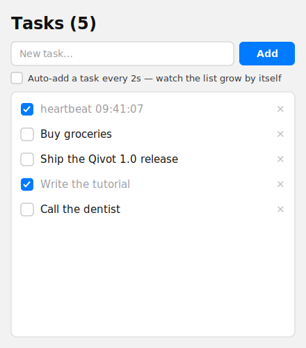

# Tutorial — Reactive Qivot (a self-updating list)

Build a to-do list where **the UI never reloads itself**. Every action just
writes to the database; the bound `ListView` refreshes automatically — even for
changes it didn't initiate. That's *Reactive Qivot*, built on a **live
`QiListModel`**.



*(mockup — run it to watch rows appear on their own)*

By the end you'll understand:

- how `QiListModel::setLive()` turns a query into a self-refreshing model,
- why `add()` / `toggle()` / `remove()` only need to `save()` — no reload call,
- and how a change from *anywhere* (even a background timer) updates the view.

> **Run it first**
> ```sh
> cd examples/reactive
> qmake && make
> ./reactive
> ```
> Tick "Auto-add every 2s" and watch rows appear on their own.

---

## Step 1 — Define the model

```cpp
// task.h
class Task : public QiModel {
    QI_MODEL
public:
    QiField<QString> title;
    QiField<int>     done;   // 0 / 1
};
QI_DECLARE_MODEL(Task, "task", QI_FIELD(title), QI_FIELD(done, QiDefault(0)));
```

`QiDefault(0)` gives new rows `done = 0` at the SQL level.

## Step 2 — Bind a *live* model

The key line. `setLive<Task>()` runs the query now **and** re-runs it (coalesced
to the event loop) whenever the `task` table changes on the connection. The
result is exposed to QML as `tasks`.

```cpp
// taskstore.cpp
TaskStore::TaskStore(QObject *parent) : QObject(parent) {
    m_model.setLive<Task>(QiConnection::defaultConnection(), [] {
        return Task::objects().orderBy(Task::col().id.desc()).all();
    });
}
```

## Step 3 — Mutations just `save()`

Notice what's *missing*: no call to reload the model. Writing to the table is
enough — the live model notices and refreshes the `ListView`.

```cpp
void TaskStore::add(const QString &title) {
    Task task; task.title = title.trimmed(); task.done = 0;
    task.save();                    // <-- that's it; the ListView updates itself
}

void TaskStore::toggle(int id) {
    Task task;
    if (task.load(Task::col().id == id)) {
        task.done = task.done->toInt() ? 0 : 1;
        task.save();
    }
}
```

## Step 4 — Bind the QML

A plain `ListView` on `store.tasks`. Each field is a role (`title`, `done`, `id`),
so the delegate reads them directly. `store.tasks.count` in the header updates
reactively too.

```qml
TaskStore { id: store }

Label { text: "Tasks (" + store.tasks.count + ")" }

ListView {
    model: store.tasks
    delegate: RowLayout {
        CheckBox { checked: done === 1; onToggled: store.toggle(id) }
        Label   { text: title; font.strikeout: done === 1 }
        Button  { text: "✕"; onClicked: store.remove(id) }
    }
}
```

## Step 5 — Prove it's reactive

Add a background mutation source with no connection to the UI. When it writes,
the list still updates — because the model reacts to the *data*, not the button
that changed it.

```qml
Timer {
    interval: 2000; repeat: true; running: autoCheckbox.checked
    onTriggered: store.add("heartbeat " + Qt.formatDateTime(new Date(), "hh:mm:ss"))
}
```

---

## How it works

`setLive()` registers a change hook on the `QiConnection`. Every successful
`save()` / `remove()` / bulk `update()` notifies that hook with the affected
table name; the model schedules a single coalesced refresh (so a burst of writes
is one reload) and re-runs your query. No polling, no manual signals.

## Files

| File | Role |
|---|---|
| `task.h` | The `Task` model — `title`, `done`. |
| `taskstore.h` / `.cpp` | QML controller: one `setLive<Task>()` call; `add`/`toggle`/`remove` just `save()`. |
| `main.cpp` | Opens the DB, creates the table, loads the QML. |
| `main.qml` | The to-do UI + the "auto-add every 2s" proof. |

## See also

- [`contacts`](../contacts) — a live model scaled up with **windowed fetching**.
- [`qmlmodel`](../qmlmodel) — `QiListModel` with a `Q_GADGET` model and search.
