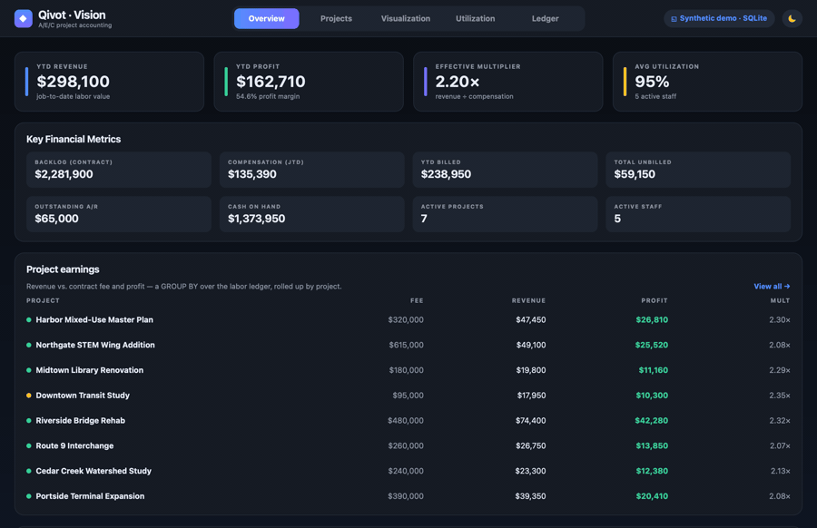
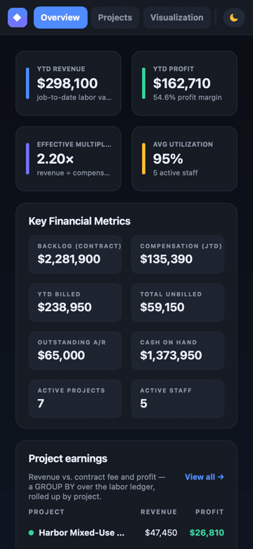

# vision — a Deltek-Vision-style project-accounting demo, on Qivot



**▶ [Try it live in your browser](https://austinkottke.github.io/Qivot/vision/)** — the full app,
compiled to WebAssembly and served from GitHub Pages. No install; it runs entirely client-side,
SQLite and all.

> ⚠️ **This does NOT connect to a real Deltek Vision database.** Every number here is
> **synthetic** — invented firms, people, and figures generated at startup. It runs on
> **SQLite** (and is proven against a real SQL Server). There is no Deltek software, no
> `VisionDemo76`, and no Deltek data anywhere in this example. What's "Vision" about it is
> the **schema shape** — the table codes, natural keys, column names, and the JTD/YTD
> metrics mirror Vision so the *same Qivot models* would map onto a real Vision database.
> See [Pointing it at a real Vision database](#pointing-it-at-a-real-vision-database).

---

Deltek Vision is the ERP that architecture/engineering/construction firms run on, and it
stores everything in **Microsoft SQL Server**. This example models Vision's core tables with
Qivot, then builds the reports a principal actually looks at — **project earnings**,
**utilization**, **a company-wide profitability treemap**, and a live **labor ledger** — and
proves the exact same code runs on SQLite, SQL Server, Postgres, and more.

It's a tour of what Qivot does well:

- **Natural-key models** (no surrogate `id`) that match a real-world schema 1:1
- **Aggregate reporting** — `GROUP BY` / `JOIN` / `SUM` mapped straight into typed rows
- **Reactive UI** — a `QiListModel` that re-queries itself when the data changes
- **One model set, any SQL dialect** — the same schema emits correct DDL for six backends
- **Runs on the desktop, in the browser (WASM), and headless** from one codebase

## Contents

- [Quick start](#quick-start)
- [The five screens](#the-five-screens)
- [The schema](#the-schema-visions-tables-as-qivot-models)
- [The reports (GROUP BY, typed)](#the-reports-group-by-mapped-into-typed-rows)
- [The reactive ledger](#the-reactive-ledger-write-one-row-everything-updates)
- [One model set, six databases](#one-model-set-six-databases)
- [WebAssembly](#running-it-in-the-browser-webassembly)
- [Pointing it at a real Vision database](#pointing-it-at-a-real-vision-database)
- [File map](#file-map)

## Quick start

```bash
qmake && make      # Qt 5.15 or 6.x

./vision           # ① desktop app (dark-mode Qt Quick dashboard, in-memory SQLite)
./vision --report  # ② the two reports, printed to the terminal
./vision --script sqlserver   # ③ a runnable T-SQL script (DDL + seed + reports)
```

No server or setup — the desktop app uses an in-memory database and seeds itself. For the
browser build see [WebAssembly](#running-it-in-the-browser-webassembly); for other databases
see [One model set, six databases](#one-model-set-six-databases).

Here's what `./vision --report` prints — the whole point of the demo, in one screen:

```
  PROJECT EARNINGS  (contract fee vs. billed labor vs. cost)
  WBS1         Project                               Fee     Billed       Cost     Margin    %Fee
  ----------------------------------------------------------------------------------------------
  2024002.00   Harbor Mixed-Use Master Plan       320000      47450      20640      26810     15%
  2024003.00   Northgate STEM Wing Addition       615000      49100      23580      25520      8%
  2024011.00   Midtown Library Renovation         180000      19800       8640      11160     11%
  2023045.00   Downtown Transit Study              95000      17950       7650      10300     19%
  2024001.00   Riverside Bridge Rehab             480000      74400      32120      42280     16%
  2024007.00   Route 9 Interchange                260000      26750      12900      13850     10%
  2024005.00   Cedar Creek Watershed Study        240000      23300      10920      12380     10%
  2024009.00   Portside Terminal Expansion        390000      39350      18940      20410     10%

  EMPLOYEE UTILIZATION  (active staff)
  Emp    Name                      Total h   Billable    Util%
  ------------------------------------------------------------
  E001   Vance, Dana                  80.0       70.0    87.5%
  E002   Ruiz, Marco                 320.0      320.0   100.0%
  E003   Cole, Priya                 610.0      590.0    96.7%
  E004   Osei, Kwame                 770.0      730.0    94.8%
  E006   Nash, Ivy                   446.0      430.0    96.4%
```
(Ordered by organization, then WBS1 — Architecture, Civil Engineering, Environmental.)

## The five screens

`./vision` opens a Qt Quick dashboard (dark by default, with a light/dark toggle). It speaks
Vision's vocabulary: **Revenue** (job-to-date labor value), **Compensation** (direct labor
cost), **Profit**, and the **Effective Multiplier** (revenue ÷ compensation).

| Screen | What it shows |
|--------|---------------|
| **Overview** | A **Key Financial Metrics** panel — YTD Revenue/Profit, Effective Multiplier, YTD Billed, Total Unbilled, Outstanding A/R, Cash on Hand, Backlog — plus earnings and utilization snapshots. |
| **Projects** | Earnings **grouped by Organization** with per-org profit and multiplier subtotals, Principal-In-Charge vs. Project Manager, and status pills. (Vision's "Project Earnings by Org".) |
| **Visualization** | A **Company Project Visualization** treemap — tiles grouped by org, **sized by Compensation**, **coloured by Profit** (red → blue). |
| **Utilization** | Per-employee gauges: billable ÷ total hours, active staff only. |
| **Labor Ledger** | A **live** table of posted labor. Hit **Post labor**, add a row, and every metric, report, and the treemap recompute instantly. |

## The schema: Vision's tables as Qivot models

Vision keys its master tables on **natural string keys** — a project *is* its `WBS1`, an
employee *is* their `Employee` number — with **no surrogate `id` column**. Qivot models that
directly with `QI_DECLARE_MODEL_NOID` and a `QiPrimary` field. Column names match Vision's, so
the mapping is 1:1:

```cpp
// PR — the project master. Its identity is WBS1 (Vision's project number).
class Pr : public QiModel {
    QI_MODEL
public:
    QiField<QString> WBS1;        // primary key, e.g. "2024001.00"
    QiField<QString> Name;
    QiField<QString> Org;         // organization it rolls up to
    QiField<QString> Status;      // 'A' active / 'I' inactive / 'D' dormant
    QiField<QString> ProjMgr;     // -> EM.Employee (Project Manager)
    QiField<QString> Principal;   // -> EM.Employee (Principal-In-Charge)
    QiField<QString> ClientID;    // -> CL.ClientID
    QiField<double>  Fee;         // negotiated contract fee
    QiField<QString> ChargeType;  // 'R' regular / 'H' overhead
};
QI_DECLARE_MODEL_NOID(Pr, "PR",
    QI_FIELD(WBS1, QiPrimary | QiNotNull),
    QI_FIELD(Name), QI_FIELD(Org), QI_FIELD(Status), QI_FIELD(ProjMgr),
    QI_FIELD(Principal), QI_FIELD(ClientID), QI_FIELD(Fee), QI_FIELD(ChargeType));
```

The transactional tables *do* get an auto-increment `id` (`QI_DECLARE_MODEL`), which on SQL
Server becomes an `IDENTITY` column — see [six databases](#one-model-set-six-databases):

```cpp
// LD — posted labor. One row per person-per-project-per-day.
class Ld : public QiModel {
    QI_MODEL
public:
    QiField<QString> WBS1;        // -> PR.WBS1
    QiField<QString> Employee;    // -> EM.Employee
    QiField<QString> TransDate;   // yyyy-MM-dd
    QiField<double>  RegHrs;
    QiField<double>  BillRate;    // rate in effect at posting
    QiField<double>  CostRate;
};
QI_DECLARE_MODEL(Ld, "LD",
    QI_FIELD(WBS1), QI_FIELD(Employee), QI_FIELD(TransDate),
    QI_FIELD(RegHrs), QI_FIELD(BillRate), QI_FIELD(CostRate));
```

The full set:

| Qivot model | Table | Key | Role |
|-------------|-------|-----|------|
| `Cl` | `CL` | `ClientID` (natural string) | client master |
| `Em` | `EM` | `Employee` (natural string) | employee master |
| `Pr` | `PR` | `WBS1` (natural string) | project master — with `Org`, `Principal`, `ProjMgr` |
| `Ld` | `LD` | `id` (auto-increment) | posted labor ledger |
| `Bi` | `BI` | `id` (auto-increment) | billing/AR ledger (invoiced + received) |

Seeding is plain object writes — set fields, call `save()`:

```cpp
Pr p;
p.WBS1 = "2024001.00"; p.Name = "Riverside Bridge Rehab"; p.Org = "Civil Engineering";
p.Status = "A"; p.ProjMgr = "E001"; p.Principal = "E001"; p.ClientID = "C001"; p.Fee = 480000;
p.ChargeType = "R";
p.save();                                    // INSERT (dialect-correct for the open connection)
```

**Faithful vs. simplified.** Faithful: table codes (`CL`/`EM`/`PR`/`LD`/`BI`), natural keys,
column names, the Organization dimension, and JTD/YTD metric definitions. Simplified: Vision
keys projects on the **WBS triplet** (`WBS1`/`WBS2`/`WBS3` = project/phase/task) — this models
the `WBS1` grain only; Vision derives rates from **rate tables** — here each employee carries
one rate; and Cash on Hand is an illustrative firm figure (Vision reads it from the GL).

## The reports: GROUP BY, mapped into typed rows

The reports are ordinary SQL aggregates. Qivot's `qiRawQuery<T>` runs the query and
materializes each result row into a typed model whose fields match the `SELECT` aliases — so
you write the SQL you want and get objects back, no manual row parsing:

```cpp
// Project earnings: revenue vs. cost per project, rolled up by organization.
static const char *kEarningsSql =
    "SELECT pr.WBS1 AS WBS1, pr.Name AS Name, pr.Org AS Org, pr.Status AS Status, "
    "       pr.ProjMgr AS ProjMgr, pr.Principal AS Principal, pr.Fee AS Fee, "
    "       COALESCE(SUM(ld.RegHrs * ld.BillRate), 0) AS Billed, "   // revenue
    "       COALESCE(SUM(ld.RegHrs * ld.CostRate), 0) AS Cost "      // compensation
    "FROM PR pr LEFT JOIN LD ld ON ld.WBS1 = pr.WBS1 "
    "WHERE pr.ChargeType = 'R' "
    "GROUP BY pr.WBS1, pr.Name, pr.Org, pr.Status, pr.ProjMgr, pr.Principal, pr.Fee "
    "ORDER BY pr.Org, pr.WBS1";

QiList<ProjectEarnings> rows = qiRawQuery<ProjectEarnings>(kEarningsSql);
for (int i = 0; i < rows.size(); i++) {
    ProjectEarnings *e = rows.at(i);
    double profit     = e->Billed - e->Cost;
    double multiplier = e->Cost > 0 ? e->Billed / e->Cost : 0;   // Vision's Effective Multiplier
    // ... hand to QML, or print
}
```

`ProjectEarnings` is just a shape — a `QiModel` whose fields name the columns (it's never a
table). From these rows the store derives everything else the dashboard shows: the **by-org
rollup** (group the rows by `Org`), the **treemap tiles** (size = `Cost`, colour = normalized
profit), and the firm-wide **Key Financial Metrics**. The billing metrics come from a second
tiny query over the `BI` ledger:

```cpp
double invoiced = 0, received = 0;
QiList<Bi> bis = Bi::objects().all();
for (int i = 0; i < bis.size(); i++) { invoiced += bis.at(i)->Amount; received += bis.at(i)->Received; }
double outstandingAR = invoiced - received;
double unbilled      = qMax(0.0, firmRevenue - invoiced);
```

Everyday queries use the fluent builder instead of raw SQL — e.g. active staff only:

```cpp
QiList<Em> active = Em::objects()
    .filter(QiWhere("Status = ", QString("A")))
    .orderBy("Employee")
    .all();
```

## The reactive ledger: write one row, everything updates

The Labor Ledger is a `QiListModel` bound to a **live** query. `setLive` re-runs the query
(coalesced) whenever the `LD` table changes on the connection — no manual refresh, no signals
to wire:

```cpp
// in the store's constructor — the ledger tracks the LD table
m_ledger.setLive<Ld>(QiConnection::defaultConnection(), [] {
    return Ld::objects().orderBy(Ld::col().id.desc()).all();
});
```

So "Post labor" is just a `save()` — the ledger refreshes itself, and the store recomputes the
reports in the same breath:

```cpp
bool VisionStore::postLabor(const QString &wbs1, const QString &employee,
                            const QString &date, double hours, double billRate, double costRate) {
    Ld l;
    l.WBS1 = wbs1; l.Employee = employee; l.TransDate = date;
    l.RegHrs = hours; l.BillRate = billRate; l.CostRate = costRate;
    if (!l.save()) return false;   // one INSERT...
    refreshReports();              // ...recompute metrics/earnings/treemap; the QiListModel
    return true;                   //    updates on its own via setLive
}
```

Add a row in the UI and watch the KPI tiles, the earnings table, and the treemap all move at
once. That's the same pattern as the repo's `reactive` example, applied to a real report.

## One model set, six databases

The dashboard runs on SQLite, but the **models are backend-agnostic** — the only thing that
changes per database is the connection. To run against SQL Server (which is what real Vision
uses):

```cpp
QSqlDatabase db = QSqlDatabase::addDatabase("QODBC");
db.setDatabaseName("Driver={ODBC Driver 18 for SQL Server};Server=host,1433;"
                   "Database=vision;Uid=sa;Pwd=…;TrustServerCertificate=yes;");
db.open();

QiConnection conn;
conn.open(db);                    // Qivot sees QODBC → emits T-SQL
conn.addModel<Cl>(); conn.addModel<Em>(); conn.addModel<Pr>();
conn.addModel<Ld>(); conn.addModel<Bi>();
// ... the exact same reporting code runs unchanged
```

Qivot's dialect layer turns one schema into the right DDL for each engine. `./vision --ddl
<dialect>` prints it — same models, different SQL:

```sql
-- ./vision --ddl sqlserver   (natural key → NVARCHAR PK; ledger → IDENTITY)
CREATE TABLE PR (
  WBS1 NVARCHAR(450) NOT NULL PRIMARY KEY, Name NVARCHAR(MAX), Org NVARCHAR(MAX),
  ..., Fee FLOAT, ChargeType NVARCHAR(MAX)
);
CREATE TABLE LD ( id INT IDENTITY(1,1) PRIMARY KEY, WBS1 NVARCHAR(MAX), ... );

-- ./vision --ddl postgres    (TEXT PK; ledger → GENERATED IDENTITY)
CREATE TABLE IF NOT EXISTS PR ( WBS1 TEXT NOT NULL PRIMARY KEY, ... );
CREATE TABLE IF NOT EXISTS LD ( id INTEGER PRIMARY KEY GENERATED BY DEFAULT AS IDENTITY, ... );
```

`<dialect>` = `sqlite` | `sqlserver` | `postgres` | `mysql` | `oracle` | `duckdb`.

**Proving it on a real SQL Server.** `--script sqlserver` emits the full runnable script —
Qivot-generated DDL, plus seed data and the report queries. Pipe it into a genuine SQL Server
and the reports come back from the real engine:

```bash
docker run -d --name mssql -e ACCEPT_EULA=Y -e MSSQL_SA_PASSWORD=Qivot_Test1 \
  -p 1433:1433 mcr.microsoft.com/mssql/server:2022-latest
docker exec mssql /opt/mssql-tools18/bin/sqlcmd -S localhost -U sa -P Qivot_Test1 -C \
  -Q "IF DB_ID('vision_demo') IS NULL CREATE DATABASE vision_demo;"

./vision --script sqlserver | docker exec -i mssql \
  /opt/mssql-tools18/bin/sqlcmd -S localhost -U sa -P Qivot_Test1 -C -d vision_demo
```

The numbers match the SQLite run exactly — same models, same reports, different engine.

## Running it in the browser (WebAssembly)

The app compiles with **Qt for WebAssembly** — the same C++/QML, no server, SQLite included,
all running in the browser. On every push to `main` that touches this example,
[`wasm.yml`](../../.github/workflows/wasm.yml) builds it and publishes to
**<https://austinkottke.github.io/Qivot/vision/>**, so the live link at the top stays current.

The layout is responsive, so the browser build works on phones too — the nav collapses to a
scrollable strip, the KPI cards stack, and the treemap re-flows into vertical org bands:




**Build it yourself with Docker** (no local Qt-wasm toolchain needed):

```bash
cd wasm && ./build.sh
(cd dist && python3 -m http.server 8000)   # → http://localhost:8000/vision.html
```

`wasm/build.sh` builds a Qt-6.7.2 + emscripten-3.1.50 toolchain image (the pairing the CI
uses), then shadow-compiles the example against it with the repo mounted read-only, so it
never touches your source tree. Artifacts land in `wasm/dist/`.

**Or with a local Qt-wasm kit:**

```bash
/path/to/Qt/6.7.x/wasm_singlethread/bin/qmake && make -j   # host tools via QT_HOST_PATH
python3 -m http.server 8080                                 # → open vision.html
```

The `wasm:` block in `vision.pro` statically links the SQLite driver (WebAssembly has no
runtime plugin loading); the in-memory `:memory:` database means nothing else changes. Serve
over HTTP — a `file://` open won't instantiate the `.wasm`.

## Pointing it at a real Vision database

Nothing here talks to Deltek — but because the models mirror Vision's schema, the swap is a
**connection change, not a rewrite.** If you have a Vision install (or Deltek's downloadable
`VisionDemo76` sample DB restored to SQL Server):

1. Replace the in-memory SQLite connection in `main.cpp` with a **read-only** QODBC connection
   to your Vision SQL Server (see the snippet under [six databases](#one-model-set-six-databases)).
2. **Do not** call `createTables()` / `dropTables()` — the Vision schema already exists and is
   owned by Deltek. Just `addModel<>()` and run the report queries.
3. Read from Vision's **reporting views** where you can rather than base tables, and treat
   writes as off-limits — Vision's tables have triggers and posting logic, so direct writes are
   unsupported by Deltek. For writes, go through Vision's Web Services API, not Qivot.

The demo simplifies Vision (see *Faithful vs. simplified* above), so a real DB may need column
tweaks — but the reporting shape (`GROUP BY` over `LD`, joined to `PR`/`EM`) is the same.

> All data in this example is **synthetic** — a schema-shaped teaching mock, not Deltek code
> or data.

## File map

```
vision/
├── models.h          CL / EM / PR / LD / BI models + report-row shapes
├── seeddata.h        the synthetic firm (clients, staff, projects, labor, billing) + report SQL
├── main.cpp          app entry: seeds SQLite, launches QML; --report / --ddl / --script modes
├── visionstore.{h,cpp}  the controller — runs the queries, derives metrics/org rollup/treemap,
│                        exposes the live ledger + postLabor()
├── theme.{h,cpp}     design tokens + light/dark palette (runtime switch) + formatters
├── *.qml             the UI: main, TopBar, KpiCard, SectionCard, OverviewView, ProjectsView,
│                        TreemapView, UtilizationView, LedgerView, PostLaborDialog
├── vision.pro        qmake project (adds `wasm: QTPLUGIN += qsqlite` for the browser build)
├── wasm/             Docker-based WebAssembly build (Dockerfile + build.sh)
└── media/            README graphics (desktop + mobile walkthrough GIFs)
```

### What this example demonstrates about Qivot

- **Natural / composite keys** without a surrogate `id` (`QI_DECLARE_MODEL_NOID` + `QiPrimary`)
- **Typed aggregate reporting** via `qiRawQuery<T>` — `JOIN` / `GROUP BY` / `SUM` → objects
- **The fluent query builder** — `objects().filter(...).orderBy(...).all()`
- **Reactive models** — `QiListModel::setLive` re-queries on data change; UI updates itself
- **Cross-dialect DDL** from one schema — SQLite, SQL Server, Postgres, MySQL, Oracle, DuckDB
- **Portable deployment** — desktop, headless CLI, and WebAssembly from a single codebase
